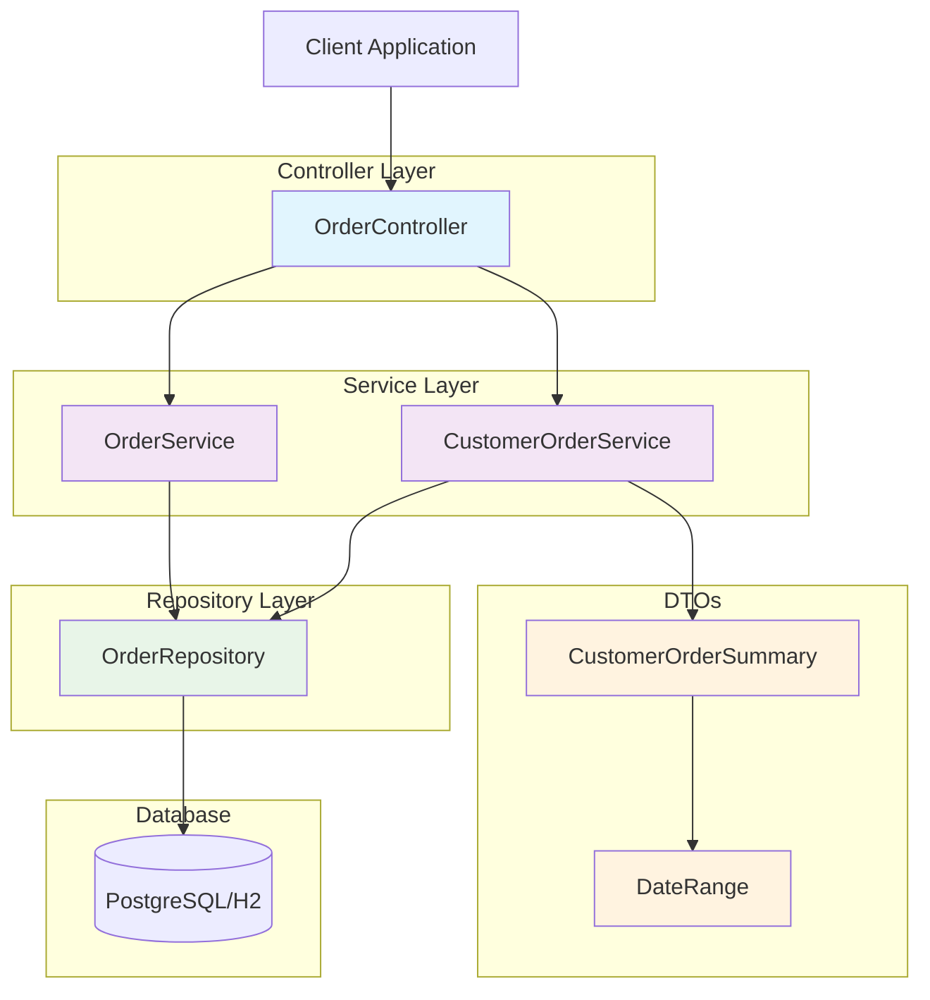

# Technical Design Document
**Story:** STORY-1
**Generated:** 2026-03-06T20:57:40.149862
**Status:** In Review

---

# Technical Design Document: Customer Search and Order History Endpoints

## 1. Overview and Objectives

### Purpose
Implement customer search and order history functionality to enable retrieval of order information by customer email address, including detailed order lists and summary statistics.

### Objectives
- Provide customer order retrieval with pagination and date filtering
- Implement customer order summary statistics
- Maintain consistency with existing architectural patterns
- Ensure comprehensive test coverage and API documentation

### Scope
- Two new REST endpoints for customer order operations
- Enhanced repository layer with pagination and filtering
- New DTOs for order summary data
- Complete test suite and API documentation

## 2. API Specifications

### 2.1 Customer Orders Endpoint

```yaml
GET /api/v1/orders/customer/{email}

Parameters:
  - email (path): Customer email address
  - page (query, optional): Page number (default: 0)
  - size (query, optional): Page size (default: 20, max: 100)
  - sort (query, optional): Sort criteria (default: createdDate,desc)
  - fromDate (query, optional): Start date filter (ISO 8601: yyyy-MM-dd)
  - toDate (query, optional): End date filter (ISO 8601: yyyy-MM-dd)

Responses:
  200: Paginated order list
  400: Invalid email format or date parameters
  404: No orders found for customer
```

**Request Example:**
```
GET /api/v1/orders/customer/john.doe@email.com?page=0&size=10&fromDate=2024-01-01&toDate=2024-12-31
```

**Response Schema (200):**
```json
{
  "content": [
    {
      "id": "ORD-001",
      "customerEmail": "john.doe@email.com",
      "status": "COMPLETED",
      "totalAmount": 299.99,
      "createdDate": "2024-01-15T10:30:00Z",
      "items": [
        {
          "productId": "PROD-001",
          "quantity": 2,
          "unitPrice": 149.99,
          "totalPrice": 299.98
        }
      ]
    }
  ],
  "pageable": {
    "sort": {
      "sorted": true,
      "orderBy": "createdDate,desc"
    },
    "pageNumber": 0,
    "pageSize": 10
  },
  "totalElements": 25,
  "totalPages": 3,
  "last": false,
  "first": true,
  "numberOfElements": 10
}
```

### 2.2 Customer Order Summary Endpoint

```yaml
GET /api/v1/orders/customer/{email}/summary

Parameters:
  - email (path): Customer email address
  - fromDate (query, optional): Start date filter
  - toDate (query, optional): End date filter

Responses:
  200: Order summary statistics
  400: Invalid email format or date parameters
  404: No orders found for customer
```

**Response Schema (200):**
```json
{
  "customerEmail": "john.doe@email.com",
  "totalOrders": 25,
  "totalAmountSpent": 7499.75,
  "firstOrderDate": "2023-06-15T09:15:00Z",
  "lastOrderDate": "2024-01-20T14:45:00Z",
  "ordersByStatus": {
    "COMPLETED": 20,
    "PENDING": 3,
    "CANCELLED": 2
  },
  "dateRange": {
    "fromDate": "2024-01-01",
    "toDate": "2024-12-31"
  }
}
```

## 3. Data Model Changes

### 3.1 New DTOs

**CustomerOrderSummary.java**
```java
@Data
@Builder
@AllArgsConstructor
@NoArgsConstructor
public class CustomerOrderSummary {
    
    @Schema(description = "Customer email address", example = "john.doe@email.com")
    private String customerEmail;
    
    @Schema(description = "Total number of orders", example = "25")
    private Long totalOrders;
    
    @Schema(description = "Total amount spent across all orders", example = "7499.75")
    private BigDecimal totalAmountSpent;
    
    @Schema(description = "Date of first order")
    private LocalDateTime firstOrderDate;
    
    @Schema(description = "Date of most recent order")
    private LocalDateTime lastOrderDate;
    
    @Schema(description = "Breakdown of orders by status")
    private Map<OrderStatus, Long> ordersByStatus;
    
    @Schema(description = "Date range filter applied")
    private DateRange dateRange;
}
```

**DateRange.java**
```java
@Data
@Builder
@AllArgsConstructor
@NoArgsConstructor
public class DateRange {
    
    @Schema(description = "Start date of filter range")
    private LocalDate fromDate;
    
    @Schema(description = "End date of filter range")
    private LocalDate toDate;
}
```

### 3.2 Repository Enhancements

No database schema changes required. Leveraging existing `Order` entity with new repository methods.

## 4. Architecture Diagram



## 5. Service Layer Design

### 5.1 Enhanced OrderService

```java
@Service
@Transactional
public class OrderService {
    
    @Autowired
    private OrderRepository orderRepository;
    
    /**
     * Retrieves paginated orders for a customer with optional date filtering
     */
    public Page<Order> getCustomerOrders(String email, Pageable pageable, 
                                       LocalDate fromDate, LocalDate toDate) {
        validateEmail(email);
        
        Page<Order> orders;
        if (fromDate != null || toDate != null) {
            LocalDateTime fromDateTime = fromDate != null ? 
                fromDate.atStartOfDay() : LocalDateTime.of(2000, 1, 1, 0, 0);
            LocalDateTime toDateTime = toDate != null ? 
                toDate.atTime(23, 59, 59) : LocalDateTime.now();
                
            orders = orderRepository.findByCustomerEmailAndCreatedDateBetween(
                email, fromDateTime, toDateTime, pageable);
        } else {
            orders = orderRepository.findByCustomerEmail(email, pageable);
        }
        
        if (orders.isEmpty()) {
            throw new OrderNotFoundException("No orders found for customer: " + email);
        }
        
        return orders;
    }
    
    /**
     * Generates order summary statistics for a customer
     */
    public CustomerOrderSummary getCustomerOrderSummary(String email, 
                                                       LocalDate fromDate, 
                                                       LocalDate toDate) {
        validateEmail(email);
        
        List<Order> orders = getFilteredOrders(email, fromDate, toDate);
        
        if (orders.isEmpty()) {
            throw new OrderNotFoundException("No orders found for customer: " + email);
        }
        
        return buildOrderSummary(email, orders, fromDate, toDate);
    }
    
    private List<Order> getFilteredOrders(String email, LocalDate fromDate, LocalDate toDate) {
        if (fromDate != null || toDate != null) {
            LocalDateTime fromDateTime = fromDate != null ? 
                fromDate.atStartOfDay() : LocalDateTime.of(2000, 1, 1, 0, 0);
            LocalDateTime toDateTime = toDate != null ? 
                toDate.atTime(23, 59, 59) : LocalDateTime.now();
                
            return orderRepository.findByCustomerEmailAndCreatedDateBetween(
                email, fromDateTime, toDateTime);
        }
        
        return orderRepository.findByCustomerEmail(email);
    }
    
    private CustomerOrderSummary buildOrderSummary(String email, List<Order> orders, 
                                                  LocalDate fromDate, LocalDate toDate) {
        BigDecimal totalAmount = orders.stream()
            .map(Order::getTotalAmount)
            .reduce(BigDecimal.ZERO, BigDecimal::add);
            
        Map<OrderStatus, Long> statusBreakdown = orders.stream()
            .collect(groupingBy(Order::getStatus, counting()));
            
        LocalDateTime firstOrder = orders.stream()
            .map(Order::getCreatedDate)
            .min(LocalDateTime::compareTo)
            .orElse(null);
            
        LocalDateTime lastOrder = orders.stream()
            .map(Order::getCreatedDate)
            .max(LocalDateTime::compareTo)
            .orElse(null);
            
        return CustomerOrderSummary.builder()
            .customerEmail(email)
            .totalOrders((long) orders.size())
            .totalAmountSpent(totalAmount)
            .firstOrderDate(firstOrder)
            .lastOrderDate(lastOrder)
            .ordersByStatus(statusBreakdown)
            .dateRange(DateRange.builder()
                .fromDate(fromDate)
                .toDate(toDate)
                .build())
            .build();
    }
    
    private void validateEmail(String email) {
        if (!EmailValidator.getInstance().isValid(email)) {
            throw new IllegalArgumentException("Invalid email format: " + email);
        }
    }
}
```

### 5.2 Enhanced OrderRepository

```java
@Repository
public interface OrderRepository extends JpaRepository<Order, String> {
    
    // Existing method
    List<Order> findByCustomerEmail(String email);
    
    // New methods for pagination and date filtering
    Page<Order> findByCustomerEmail(String email, Pageable pageable);
    
    Page<Order> findByCustomerEmailAndCreatedDateBetween(
        String email, 
        LocalDateTime fromDate, 
        LocalDateTime toDate, 
        Pageable pageable
    );
    
    List<Order> findByCustomerEmailAndCreatedDateBetween(
        String email, 
        LocalDateTime fromDate, 
        LocalDateTime toDate
    );
}
```

### 5.3 Enhanced OrderController

```java
@RestController
@RequestMapping("/api/v1/orders")
@Validated
@Tag(name = "Order Management", description = "Order management operations")
public class OrderController {
    
    @Autowired
    private OrderService orderService;
    
    @GetMapping("/customer/{email}")
    @Operation(summary = "Get customer orders", 
               description = "Retrieve paginated orders for a specific customer")
    @ApiResponses({
        @ApiResponse(responseCode = "200", description = "Orders retrieved successfully"),
        @ApiResponse(responseCode = "400", description = "Invalid request parameters"),
        @ApiResponse(responseCode = "404", description = "No orders found for customer")
    })
    public ResponseEntity<Page<Order>> getCustomerOrders(
            @PathVariable @Email(message = "Invalid email format") String email,
            @PageableDefault(size = 20, sort = "createdDate", direction = Sort.Direction.DESC) 
            Pageable pageable,
            @RequestParam(required = false) 
            @DateTimeFormat(iso = DateTimeFormat.ISO.DATE) LocalDate fromDate,
            @RequestParam(required = false) 
            @DateTimeFormat(iso = DateTimeFormat.ISO.DATE) LocalDate toDate) {
            
        validateDateRange(fromDate, toDate);
        
        Page<Order> orders = orderService.getCustomerOrders(email, pageable, fromDate, toDate);
        return ResponseEntity.ok(orders);
    }
    
    @GetMapping("/customer/{email}/summary")
    @Operation(summary = "Get customer order summary", 
               description = "Retrieve order statistics and summary for a specific customer")
    @ApiResponses({
        @ApiResponse(responseCode = "200", description = "Summary retrieved successfully"),
        @ApiResponse(responseCode = "400", description = "Invalid request parameters"),
        @ApiResponse(responseCode = "404", description = "No orders found for customer")
    })
    public ResponseEntity<CustomerOrderSummary> getCustomerOrderSummary(
            @PathVariable @Email(message = "Invalid email format") String email,
            @RequestParam(required = false) 
            @DateTimeFormat(iso = DateTimeFormat.ISO.DATE) LocalDate fromDate,
            @RequestParam(required = false) 
            @DateTimeFormat(iso = DateTimeFormat.ISO.DATE) LocalDate toDate) {
            
        validateDateRange(fromDate, toDate);
        
        CustomerOrderSummary summary = orderService.getCustomerOrderSummary(email, fromDate, toDate);
        return ResponseEntity.ok(summary);
    }
    
    private void validateDateRange(LocalDate fromDate, LocalDate toDate) {
        if (fromDate != null && toDate != null && fromDate.isAfter(toDate)) {
            throw new IllegalArgumentException("fromDate cannot be after toDate");
        }
    }
}
```

## 6. Testing Strategy

### 6.1 Unit Tests

**OrderServiceTest.java**
```java
@ExtendWith(MockitoExtension.class)
class OrderServiceTest {
    
    @Mock
    private OrderRepository orderRepository;
    
    @InjectMocks
    private OrderService orderService;
    
    private static final String VALID_EMAIL = "test@example.com";
    private static final String INVALID_EMAIL = "invalid-email";
    
    @Test
    void getCustomerOrders_ValidEmail_ReturnsPagedOrders() {
        // Given
        Pageable pageable = PageRequest.of(0, 10);
        List<Order> orders = createSampleOrders();
        Page<Order> expectedPage = new PageImpl<>(orders, pageable, orders.size());
        
        when(orderRepository.findByCustomerEmail(VALID_EMAIL, pageable))
            .thenReturn(expectedPage);
        
        // When
        Page<Order> result = orderService.getCustomerOrders(VALID_EMAIL, pageable, null, null);
        
        // Then
        assertThat(result).isNotNull();
        assertThat(result.getContent()).hasSize(2);
        assertThat(result.getTotalElements()).isEqualTo(2);
        verify(orderRepository).findByCustomerEmail(VALID_EMAIL, pageable);
    }
    
    @Test
    void getCustomerOrders_WithDateRange_ReturnsFilteredOrders() {
        // Given
        Pageable pageable = PageRequest.of(0, 10);
        LocalDate fromDate = LocalDate.of(2024, 1, 1);
        LocalDate toDate = LocalDate.of(2024, 12, 31);
        List<Order> orders = createSampleOrders();
        Page<Order> expectedPage = new PageImpl<>(orders, pageable, orders.size());
        
        when(orderRepository.findByCustomerEmailAndCreatedDateBetween(
            eq(VALID_EMAIL), any(LocalDateTime.class), any(LocalDateTime.class), eq(pageable)))
            .thenReturn(expectedPage);
        
        // When
        Page<Order> result = orderService.getCustomerOrders(VALID_EMAIL, pageable, fromDate, toDate);
        
        // Then
        assertThat(result).isNotNull();
        assertThat(result.getContent()).hasSize(2);
        verify(orderRepository).findByCustomerEmailAndCreatedDateBetween(
            eq(VALID_EMAIL), any(LocalDateTime.class), any(LocalDateTime.class), eq(pageable));
    }
    
    @Test
    void getCustomerOrders_InvalidEmail_ThrowsException() {
        // Given
        Pageable pageable = PageRequest.of(0, 10);
        
        // When & Then
        assertThatThrownBy(() -> 
            orderService.getCustomerOrders(INVALID_EMAIL, pageable, null, null))
            .isInstanceOf(IllegalArgumentException.class)
            .hasMessageContaining("Invalid email format");
    }
    
    @Test
    void getCustomerOrders_NoOrdersFound_ThrowsOrderNotFoundException() {
        // Given
        Pageable pageable = PageRequest.of(0, 10);
        Page<Order> emptyPage = new PageImpl<>(Collections.emptyList(), pageable, 0);
        
        when(orderRepository.findByCustomerEmail(VALID_EMAIL, pageable))
            .thenReturn(emptyPage);
        
        // When & Then
        assertThatThrownBy(() -> 
            orderService.getCustomerOrders(VALID_EMAIL, pageable, null, null))
            .isInstanceOf(OrderNotFoundException.class)
            .hasMessageContaining("No orders found for customer");
    }
    
    @Test
    void getCustomerOrderSummary_ValidEmail_ReturnsSummary() {
        // Given
        List<Order> orders = createSampleOrders();
        when(orderRepository.findByCustomerEmail(VALID_EMAIL))
            .thenReturn(orders);
        
        // When
        CustomerOrderSummary result = orderService.getCustomerOrderSummary(VALID_EMAIL, null, null);
        
        // Then
        assertThat(result).isNotNull();
        assertThat(result.getCustomerEmail()).isEqualTo(VALID_EMAIL);
        assertThat(result.getTotalOrders()).isEqualTo(2);
        assertThat(result.getTotalAmountSpent()).isEqualTo(new BigDecimal("599.98"));
        assertThat(result.getOrdersByStatus()).containsEntry(OrderStatus.COMPLETED, 2L);
    }
    
    private List<Order> createSampleOrders() {
        Order order1 = Order.builder()
            .id("ORD-001")
            .customerEmail(VALID_EMAIL)
            .status(OrderStatus.COMPLETED)
            .totalAmount(new BigDecimal("299.99"))
            .createdDate(LocalDateTime.now().minusDays(5))
            .build();
            
        Order order2 = Order.builder()
            .id("ORD-002")
            .customerEmail(VALID_EMAIL)
            .status(OrderStatus.COMPLETED)
            .totalAmount(new BigDecimal("299.99"))
            .createdDate(LocalDateTime.now().minusDays(2))
            .build();
            
        return Arrays.asList(order1, order2);
    }
}
```

### 6.2 Integration Tests

**OrderControllerIntegrationTest.java**
```java
@SpringBootTest
@AutoConfigureTestDatabase
@TestMethodOrder(OrderAnnotation.class)
class OrderControllerIntegrationTest {
    
    @Autowired
    private TestRestTemplate restTemplate;
    
    @Autowired
    private OrderRepository orderRepository;
    
    private static final String BASE_URL = "/api/v1/orders";
    private static final String CUSTOMER_EMAIL = "integration.test@example.com";
    
    @BeforeEach
    void setUp() {
        orderRepository.deleteAll();
        createTestOrders();
    }
    
    @Test
    @Order(1)
    void getCustomerOrders_ValidRequest_ReturnsPagedOrders() {
        // When
        String url = BASE_URL + "/customer/" + CUSTOMER_EMAIL + "?page=0&size=5";
        ResponseEntity<String> response = restTemplate.getForEntity(url, String.class);
        
        // Then
        assertThat(response.getStatusCode()).isEqualTo(HttpStatus.OK);
        assertThat(response.getBody()).contains("\"totalElements\":3");
        assertThat(response.getBody()).contains("\"numberOfElements\":3");
    }
    
    @Test
    @Order(2)
    void getCustomerOrders_WithDateFilter_ReturnsFilteredOrders() {
        // When
        LocalDate yesterday = LocalDate.now().minusDays(1);
        String url = BASE_URL + "/customer/" + CUSTOMER_EMAIL 
            + "?fromDate=" + yesterday + "&toDate=" + LocalDate.now();
        ResponseEntity<String> response = restTemplate.getForEntity(url, String.class);
        
        // Then
        assertThat(response.getStatusCode()).isEqualTo(HttpStatus.OK);
        // Should return orders from yesterday and today only
    }
    
    @Test
    @Order(3)
    void getCustomerOrders_InvalidEmail_ReturnsBadRequest() {
        // When
        String url = BASE_URL + "/customer/invalid-email";
        ResponseEntity<String> response = restTemplate.getForEntity(url, String.class);
        
        // Then
        assertThat(response.getStatusCode()).isEqualTo(HttpStatus.BAD_REQUEST);
    }
    
    @Test
    @Order(4)
    void getCustomerOrders_NonExistentCustomer_ReturnsNotFound() {
        // When
        String url = BASE_URL + "/customer/nonexistent@example.com";
        ResponseEntity<String> response = restTemplate.getForEntity(url, String.class);
        
        // Then
        assertThat(response.getStatusCode()).isEqualTo(HttpStatus.NOT_FOUND);
    }
    
    @Test
    @Order(5)
    void getCustomerOrderSummary_ValidRequest_ReturnsSummary() {
        // When
        String url = BASE_URL + "/customer/" + CUSTOMER_EMAIL + "/summary";
        ResponseEntity<String> response = restTemplate.getForEntity(url, String.class);
        
        // Then
        assertThat(response.getStatusCode()).isEqualTo(HttpStatus.OK);
        assertThat(response.getBody()).contains("\"totalOrders\":3");
        assertThat(response.getBody()).contains("\"customerEmail\":\"" + CUSTOMER_EMAIL + "\"");
    }
    
    private void createTestOrders() {
        Order order1 = Order.builder()
            .id("INT-001")
            .customerEmail(CUSTOMER_EMAIL)
            .status(OrderStatus.COMPLETED)
            .totalAmount(new BigDecimal("100.00"))
            .createdDate(LocalDateTime.now().minusDays(3))
            .build();
            
        Order order2 = Order.builder()
            .id("INT-002")
            .customerEmail(CUSTOMER_EMAIL)
            .status(OrderStatus.PENDING)
            .totalAmount(new BigDecimal("200.00"))
            .createdDate(LocalDateTime.now().minusDays(1))
            .build();
            
        Order order3 = Order.builder()
            .id("INT-

---

## Review Checklist
- [ ] API specifications are clear and complete
- [ ] Data model changes are well-defined
- [ ] Architecture diagrams are accurate
- [ ] Testing strategy is comprehensive
- [ ] Implementation is feasible within estimated points
