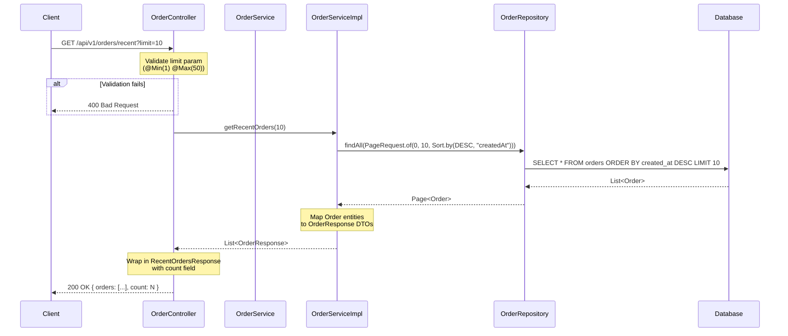

# Technical Design Document
**Story:** STORY-11
**Generated:** 2026-03-12T19:34:54.727067
**Status:** In Review

---


# Technical Design Document: STORY-004 — Add Recent Orders Endpoint

## 1. Overview and Objectives

### Overview
This story introduces a new `GET /api/v1/orders/recent` endpoint that returns the N most recently created orders, sorted by creation date descending (newest first). It is a lightweight, read-only query endpoint that leverages existing Spring Data JPA pagination capabilities with no schema changes required.

### Objectives
- Provide a simple, performant way to retrieve the most recent orders
- Support configurable result size via an optional `limit` query parameter (default: 10, range: 1–50)
- Return a purpose-built `RecentOrdersResponse` DTO containing the list of orders and a count
- Follow all existing project conventions (controller → service → repository layering, DTO pattern, OpenAPI annotations)
- Deliver comprehensive test coverage at both the service and controller layers

### Scope
| In Scope | Out of Scope |
|----------|-------------|
| New `GET /api/v1/orders/recent` endpoint | Authentication/authorization |
| `RecentOrdersResponse` DTO | New database migrations or schema changes |
| `OrderService.getRecentOrders(int)` method | Cursor-based pagination / infinite scroll |
| OpenAPI `@Operation` documentation | Filtering by status, customer, or date range |
| Unit + controller tests | Caching layer |

---

## 2. API Specification

### Endpoint

```
GET /api/v1/orders/recent?limit={limit}
```

| Attribute | Value |
|-----------|-------|
| **Method** | `GET` |
| **Path** | `/api/v1/orders/recent` |
| **Produces** | `application/json` |
| **Auth** | None (consistent with existing endpoints) |

### Query Parameters

| Parameter | Type | Required | Default | Constraints | Description |
|-----------|------|----------|---------|-------------|-------------|
| `limit` | `int` | No | `10` | `@Min(1) @Max(50)` | Number of recent orders to return |

### Response Schema — `RecentOrdersResponse`

```json
{
  "orders": [
    {
      "id": 42,
      "customerName": "John Doe",
      "customerEmail": "john.doe@example.com",
      "shippingAddress": "123 Main St, Atlanta, GA 30301",
      "orderStatus": "PENDING",
      "orderItems": [
        {
          "id": 1,
          "productName": "Power Drill",
          "quantity": 2,
          "unitPrice": 59.99,
          "subtotal": 119.98
        }
      ],
      "totalAmount": 119.98,
      "createdAt": "2025-01-15T14:30:00",
      "updatedAt": "2025-01-15T14:30:00"
    }
  ],
  "count": 1
}
```

### Response Codes

| HTTP Status | Condition | Body |
|-------------|-----------|------|
| `200 OK` | Orders found | `RecentOrdersResponse` with populated list |
| `200 OK` | No orders exist | `{ "orders": [], "count": 0 }` |
| `400 Bad Request` | `limit < 1` or `limit > 50` or non-integer | Standard Spring Boot validation error response |

### Example Requests & Responses

**Request — default limit:**
```http
GET /api/v1/orders/recent HTTP/1.1
Accept: application/json
```

**Response — 200 OK:**
```json
{
  "orders": [
    { "id": 10, "customerName": "Alice", "createdAt": "2025-01-15T10:00:00", "..." : "..." },
    { "id": 9,  "customerName": "Bob",   "createdAt": "2025-01-14T09:00:00", "..." : "..." }
  ],
  "count": 2
}
```

**Request — custom limit:**
```http
GET /api/v1/orders/recent?limit=3 HTTP/1.1
```

**Request — invalid limit:**
```http
GET /api/v1/orders/recent?limit=100 HTTP/1.1
```

**Response — 400 Bad Request:**
```json
{
  "timestamp": "2025-01-15T14:30:00",
  "status": 400,
  "error": "Bad Request",
  "message": "getRecentOrders.limit: must be less than or equal to 50"
}
```

---

## 3. Data Model Changes

### Database Schema
**No changes required.** The existing `orders` table already contains the `created_at` column that will be used for sorting.

### Existing Entity Reference

```
┌──────────────────────────────┐
│           orders             │
├──────────────────────────────┤
│ id              BIGSERIAL PK │
│ customer_name   VARCHAR      │
│ customer_email  VARCHAR      │
│ shipping_address TEXT        │
│ order_status    VARCHAR      │
│ total_amount    DECIMAL      │
│ created_at      TIMESTAMP    │  ← Sort column (DESC)
│ updated_at      TIMESTAMP    │
└──────────────────────────────┘
         │ 1
         │
         │ *
┌──────────────────────────────┐
│        order_items           │
├──────────────────────────────┤
│ id              BIGSERIAL PK │
│ order_id        BIGINT FK    │
│ product_name    VARCHAR      │
│ quantity        INT          │
│ unit_price      DECIMAL      │
│ subtotal        DECIMAL      │
└──────────────────────────────┘
```

### Index Consideration
The query will issue `ORDER BY created_at DESC LIMIT N`. If the `orders` table grows large in production, an index on `created_at DESC` would be beneficial. For this POC, the default primary key ordering and small dataset size make this unnecessary. A comment should be added in code for future reference.

---

## 4. Architecture Diagram



### Component Diagram

```mermaid
graph TB
    subgraph Controller Layer
        OC[OrderController<br/><i>+ getRecentOrders(limit)</i>]
    end
    
    subgraph DTO Layer
        ROR[RecentOrdersResponse<br/><i>- orders: List&lt;OrderResponse&gt;</i><br/><i>- count: int</i>]
        OR[OrderResponse<br/><i>existing</i>]
    end
    
    subgraph Service Layer
        OS[OrderService<br/><i>+ getRecentOrders(int limit)</i>]
        OSI[OrderServiceImpl<br/><i>implements OrderService</i>]
    end
    
    subgraph Repository Layer
        OREPO[OrderRepository<br/><i>extends JpaRepository</i><br/><i>findAll(Pageable)</i>]
    end
    
    subgraph Database
        DB[(PostgreSQL / H2)]
    end

    OC --> OS
    OS -.-> OSI
    OC --> ROR
    ROR --> OR
    OSI --> OREPO
    OREPO --> DB
    
    style ROR fill:#90EE90,stroke:#333,stroke-width:2px
    style OS fill:#87CEEB,stroke:#333,stroke-width:2px
```

> **Green** = New component, **Blue** = Modified interface

---

## 5. Service Layer Design

### 5.1 New DTO: `RecentOrdersResponse`

**Package:** `com.thd.ordermanagement.dto`

```java
package com.thd.ordermanagement.dto;

import java.util.List;

public class RecentOrdersResponse {

    private List<OrderResponse> orders;
    private int count;

    public RecentOrdersResponse() {
    }

    public RecentOrdersResponse(List<OrderResponse> orders, int count) {
        this.orders = orders;
        this.count = count;
    }

    // Getters and Setters

    public List<OrderResponse> getOrders() {
        return orders;
    }

    public void setOrders(List<OrderResponse> orders) {
        this.orders = orders;
    }

    public int getCount() {
        return count;
    }

    public void setCount(int count) {
        this.count = count;
    }
}
```

### 5.2 Interface Change: `OrderService`

Add one method to the existing interface:

```java
/**
 * Returns the most recently created orders, sorted by createdAt descending.
 *
 * @param limit the maximum number of orders to return (1–50)
 * @return list of recent orders as DTOs
 */
List<OrderResponse> getRecentOrders(int limit);
```

### 5.3 Implementation: `OrderServiceImpl`

```java
@Override
@Transactional(readOnly = true)
public List<OrderResponse> getRecentOrders(int limit) {
    logger.info("Fetching {} most recent orders", limit);

    Pageable pageable = PageRequest.of(0, limit, Sort.by(Sort.Direction.DESC, "createdAt"));
    Page<Order> page = orderRepository.findAll(pageable);

    List<OrderResponse> responses = page.getContent().stream()
            .map(this::mapToOrderResponse)
            .toList();

    logger.info("Retrieved {} recent orders", responses.size());
    return responses;
}
```

**Key design decisions:**
- The service returns `List<OrderResponse>`, and the controller wraps it in `RecentOrdersResponse`. This keeps the service focused on business logic while the controller handles response shaping.
- `@Transactional(readOnly = true)` is used since this is a read-only operation, allowing Hibernate to optimize session flushing.
- Reuses the existing `mapToOrderResponse` private method already in `OrderServiceImpl`.

**Required imports to add in `OrderServiceImpl`:**
```java
import org.springframework.data.domain.Page;
import org.springframework.data.domain.PageRequest;
import org.springframework.data.domain.Pageable;
import org.springframework.data.domain.Sort;
```

### 5.4 Controller Method: `OrderController`

```java
@GetMapping("/recent")
@Operation(
    summary = "Get recent orders",
    description = "Returns the N most recently created orders, sorted by creation date descending (newest first). " +
                  "Defaults to 10 orders. Use the 'limit' query parameter to control how many orders are returned (1–50).",
    responses = {
        @ApiResponse(responseCode = "200", description = "Recent orders retrieved successfully"),
        @ApiResponse(responseCode = "400", description = "Invalid limit parameter")
    }
)
public ResponseEntity<RecentOrdersResponse> getRecentOrders(
        @RequestParam(defaultValue = "10")
        @Min(value = 1, message = "Limit must be at least 1")
        @Max(value = 50, message = "Limit must be at most 50")
        int limit) {

    List<OrderResponse> orders = orderService.getRecentOrders(limit);
    RecentOrdersResponse response = new RecentOrdersResponse(orders, orders.size());
    return ResponseEntity.ok(response);
}
```

**Required additions to `OrderController`:**
```java
import com.thd.ordermanagement.dto.RecentOrdersResponse;
import jakarta.validation.constraints.Max;
import jakarta.validation.constraints.Min;
```

**Important:** The controller class must be annotated with `@Validated` to enable method-level parameter validation:
```java
@RestController
@RequestMapping("/api/v1/orders")
@Validated  // ADD THIS if not already present
@Tag(name = "Orders", description = "Order Management API")
public class OrderController {
```

---

## 6. Testing Strategy

### 6.1 Unit Tests: `OrderServiceImplTest`

**File:** `src/test/java/com/thd/ordermanagement/service/OrderServiceImplRecentOrdersTest.java`

(Can also be added as methods to the existing `OrderServiceImplTest` if one exists.)

```java
package com.thd.ordermanagement.service;

import com.thd.ordermanagement.dto.OrderResponse;
import com.thd.ordermanagement.model.Order;
import com.thd.ordermanagement.model.OrderStatus;
import com.thd.ordermanagement.repository.OrderRepository;
import org.junit.jupiter.api.BeforeEach;
import org.junit.jupiter.api.DisplayName;
import org.junit.jupiter.api.Nested;
import org.junit.jupiter.api.Test;
import org.junit.jupiter.api.extension.ExtendWith;
import org.mockito.ArgumentCaptor;
import org.mockito.InjectMocks;
import org.mockito.Mock;
import org.mockito.junit.jupiter.MockitoExtension;
import org.springframework.data.domain.*;

import java.math.BigDecimal;
import java.time.LocalDateTime;
import java.util.ArrayList;
import java.util.Collections;
import java.util.List;

import static org.assertj.core.api.Assertions.assertThat;
import static org.mockito.ArgumentMatchers.any;
import static org.mockito.Mockito.*;

@ExtendWith(MockitoExtension.class)
class OrderServiceImplRecentOrdersTest {

    @Mock
    private OrderRepository orderRepository;

    @InjectMocks
    private OrderServiceImpl orderService;

    private List<Order> sampleOrders;

    @BeforeEach
    void setUp() {
        sampleOrders = new ArrayList<>();
        for (int i = 1; i <= 15; i++) {
            Order order = new Order();
            order.setId((long) i);
            order.setCustomerName("Customer " + i);
            order.setCustomerEmail("customer" + i + "@example.com");
            order.setShippingAddress("Address " + i);
            order.setOrderStatus(OrderStatus.PENDING);
            order.setTotalAmount(BigDecimal.valueOf(i * 10.0));
            order.setCreatedAt(LocalDateTime.now().minusHours(i));
            order.setUpdatedAt(LocalDateTime.now().minusHours(i));
            order.setOrderItems(new ArrayList<>());
            sampleOrders.add(order);
        }
    }

    @Nested
    @DisplayName("getRecentOrders")
    class GetRecentOrders {

        @Test
        @DisplayName("should use default limit of 10 and sort by createdAt DESC")
        void shouldReturnOrdersWithDefaultLimit() {
            List<Order> top10 = sampleOrders.subList(0, 10);
            Page<Order> page = new PageImpl<>(top10);

            when(orderRepository.findAll(any(Pageable.class))).thenReturn(page);

            List<OrderResponse> result = orderService.getRecentOrders(10);

            assertThat(result).hasSize(10);

            ArgumentCaptor<Pageable> pageableCaptor = ArgumentCaptor.forClass(Pageable.class);
            verify(orderRepository).findAll(pageableCaptor.capture());

            Pageable captured = pageableCaptor.getValue();
            assertThat(captured.getPageNumber()).isEqualTo(0);
            assertThat(captured.getPageSize()).isEqualTo(10);
            assertThat(captured.getSort().getOrderFor("createdAt")).isNotNull();
            assertThat(captured.getSort().getOrderFor("createdAt").getDirection())
                    .isEqualTo(Sort.Direction.DESC);
        }

        @Test
        @DisplayName("should respect custom limit parameter")
        void shouldReturnOrdersWithCustomLimit() {
            List<Order> top5 = sampleOrders.subList(0, 5);
            Page<Order> page = new PageImpl<>(top5);

            when(orderRepository.findAll(any(Pageable.class))).thenReturn(page);

            List<OrderResponse> result = orderService.getRecentOrders(5);

            assertThat(result).hasSize(5);

            ArgumentCaptor<Pageable> pageableCaptor = ArgumentCaptor.forClass(Pageable.class);
            verify(orderRepository).findAll(pageableCaptor.capture());
            assertThat(pageableCaptor.getValue().getPageSize()).isEqualTo(5);
        }

        @Test
        @DisplayName("should return empty list when no orders exist")
        void shouldReturnEmptyListWhenNoOrders() {
            Page<Order> emptyPage = new PageImpl<>(Collections.emptyList());

            when(orderRepository.findAll(any(Pageable.class))).thenReturn(emptyPage);

            List<OrderResponse> result = orderService.getRecentOrders(10);

            assertThat(result).isEmpty();
        }

        @Test
        @DisplayName("should return fewer orders when database has less than limit")
        void shouldReturnFewerOrdersThanLimit() {
            List<Order> top3 = sampleOrders.subList(0, 3);
            Page<Order> page = new PageImpl<>(top3);

            when(orderRepository.findAll(any(Pageable.class))).thenReturn(page);

            List<OrderResponse> result = orderService.getRecentOrders(10);

            assertThat(result).hasSize(3);
        }

        @Test
        @DisplayName("should handle limit of 1")
        void shouldHandleLimitOfOne() {
            Page<Order> page = new PageImpl<>(List.of(sampleOrders.get(0)));

            when(orderRepository.findAll(any(Pageable.class))).thenReturn(page);

            List<OrderResponse> result = orderService.getRecentOrders(1);

            assertThat(result).hasSize(1);

            ArgumentCaptor<Pageable> pageableCaptor = ArgumentCaptor.forClass(Pageable.class);
            verify(orderRepository).findAll(pageableCaptor.capture());
            assertThat(pageableCaptor.getValue().getPageSize()).isEqualTo(1);
        }

        @Test
        @DisplayName("should handle limit of 50 (maximum)")
        void shouldHandleMaxLimit() {
            Page<Order> page = new PageImpl<>(sampleOrders);

            when(orderRepository.findAll(any(Pageable.class))).thenReturn(page);

            List<OrderResponse> result = orderService.getRecentOrders(50);

            ArgumentCaptor<Pageable> pageableCaptor = ArgumentCaptor.forClass(Pageable.class);
            verify(orderRepository).findAll(pageableCaptor.capture());
            assertThat(pageableCaptor.getValue().getPageSize()).isEqualTo(50);
        }
    }
}
```

### 6.2 Controller Tests: `OrderControllerRecentOrdersTest`

**File:** `src/test/java/com/thd/ordermanagement/controller/OrderControllerRecentOrdersTest.java`

```java
package com.thd.ordermanagement.controller;

import com.thd.ordermanagement.dto.OrderItemResponse;
import com.thd.ordermanagement.dto.OrderResponse;
import com.thd.ordermanagement.model.OrderStatus;
import com.thd.ordermanagement.service.OrderService;
import org.junit.jupiter.api.DisplayName;
import org.junit.jupiter.api.Nested;
import org.junit.jupiter.api.Test;
import org.springframework.beans.factory.annotation.Autowired;
import org.springframework.boot.test.autoconfigure.web.servlet.WebMvcTest;
import org.springframework.boot.test.mock.mockito.MockBean;
import org.springframework.test.web.servlet.MockMvc;

import java.math.BigDecimal;
import java.time.LocalDateTime;
import java.util.Collections;
import java.util.List;

import static org.hamcrest.Matchers.*;
import static org.mockito.Mockito.*;
import static org.springframework.test.web.servlet.request.MockMvcRequestBuilders.get;
import static org.springframework.test.web.servlet.result.MockMvcResultMatchers.*;

@WebMvcTest(OrderController.class)
class OrderControllerRecentOrdersTest {

    @Autowired
    private MockMvc mockMvc;

    @MockBean
    private OrderService orderService;

    private OrderResponse createSampleOrder(Long id, LocalDateTime createdAt) {
        return new OrderResponse(
                id,
                "Customer " + id,
                "customer" + id + "@example.com",
                "Address " + id,
                OrderStatus.PENDING,
                List.of(new OrderItemResponse(1L, "Product", 1, BigDecimal.TEN, BigDecimal.TEN)),
                BigDecimal.TEN,
                createdAt,
                createdAt
        );
    }

    @Nested
    @DisplayName("GET /api/v1/orders/recent")
    class GetRecentOrders {

        @Test
        @DisplayName("should return 200 with default limit of 10")
        void shouldReturn200WithDefaultLimit() throws Exception {
            LocalDateTime now = LocalDateTime.now();
            List<OrderResponse> orders = List.of(
                    createSampleOrder(2L, now),
                    createSampleOrder(1L, now.minusHours(1))
            );

            when(orderService.getRecentOrders(10)).thenReturn(orders);

            mockMvc.perform(get("/api/v1/orders/recent"))
                    .andExpect(status().isOk())
                    .andExpect(jsonPath("$.orders", hasSize(2)))
                    .andExpect(jsonPath("$.count", is(2)))
                    .andExpect(jsonPath("$.orders[0].id", is(2)))
                    .andExpect(jsonPath("$.orders[1].id", is(1)));

            verify(orderService).getRecentOrders(10);
        }

        @Test
        @DisplayName("should return 200 with custom limit parameter")
        void shouldReturn200WithCustomLimit() throws Exception {
            List<OrderResponse> orders = List.of(
                    createSampleOrder(5L, LocalDateTime.now())
            );

            when(orderService.getRecentOrders(1)).thenReturn(orders);

            mockMvc.perform(get("/api/v1/orders/recent").param("limit", "1"))
                    .andExp

---

## Review Checklist
- [ ] API specifications are clear and complete
- [ ] Data model changes are well-defined
- [ ] Architecture diagrams are accurate
- [ ] Testing strategy is comprehensive
- [ ] Implementation is feasible within estimated points
