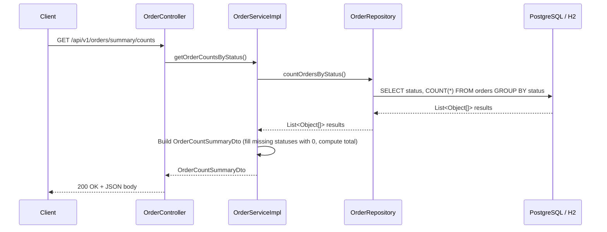
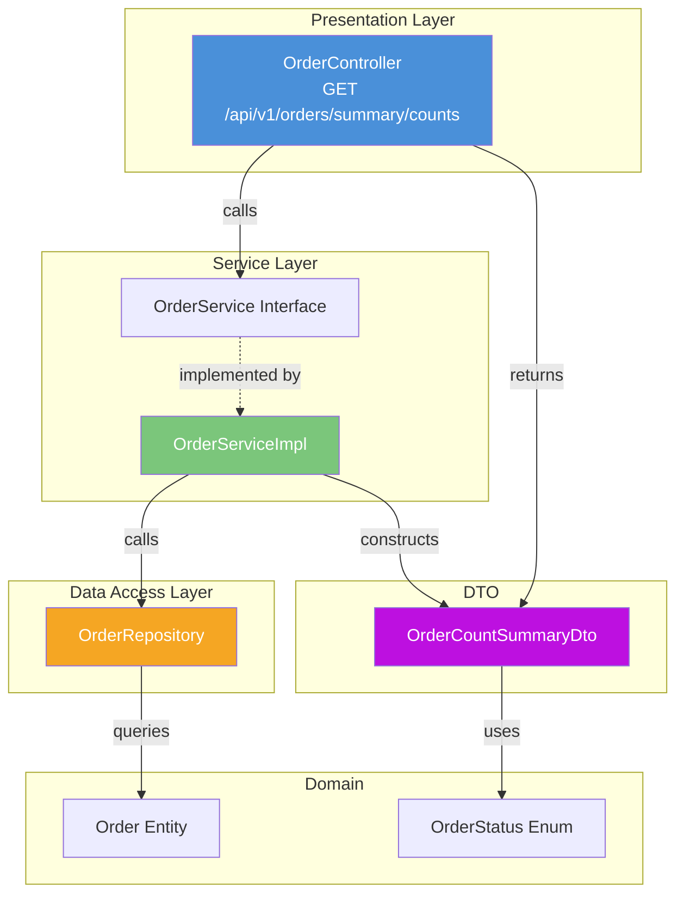
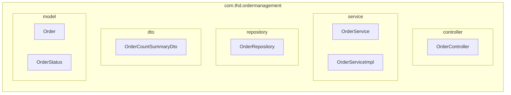

# Technical Design Document
**Story:** STORY-4
**Generated:** 2026-03-11T22:25:35.692647
**Status:** Implemented

> **Note:** This is the original pre-implementation design. The actual implementation uses `OrderCountSummaryResponse` (not `OrderCountSummaryDto`), `Map<String, Long>` for status counts (not `Map<OrderStatus, Long>`), and the repository method is named `countOrdersGroupedByStatus()`. The service method is `getOrderCountSummary()`.

---

# Technical Design Document: STORY-002 — Add Order Count Summary Endpoint

## Table of Contents

- [1. Overview and Objectives](#1-overview-and-objectives)
- [2. API Specification](#2-api-specification)
- [3. Data Model Changes](#3-data-model-changes)
- [4. Architecture Diagram](#4-architecture-diagram)
- [5. Service Layer Design](#5-service-layer-design)
- [6. Testing Strategy](#6-testing-strategy)
- [Review Checklist](#review-checklist)

## 1. Overview and Objectives

### Overview
This design describes the addition of a read-only summary endpoint to the THD Order Management Service that returns order counts grouped by `OrderStatus`. This is a lightweight reporting feature that queries existing order data without any schema modifications.

### Objectives
| Objective | Description |
|-----------|-------------|
| **Provide order count summary** | Expose a single endpoint that returns counts of orders in each status bucket plus a total |
| **Follow existing patterns** | Adhere to the established controller → service → repository layering |
| **Maintain API consistency** | Use the existing `/api/v1/orders` namespace and JSON conventions |
| **Document the endpoint** | Include OpenAPI/Swagger annotations for discoverability |
| **Ensure quality** | Deliver with comprehensive unit and integration tests |

### Scope
- **In scope:** New DTO, new service method, new controller endpoint, tests, Swagger docs
- **Out of scope:** Database schema changes, pagination, filtering by date range, caching (future enhancement)

---

## 2. API Specification

### Endpoint

```
GET /api/v1/orders/summary/counts
```

| Attribute | Value |
|-----------|-------|
| **HTTP Method** | `GET` |
| **Path** | `/api/v1/orders/summary/counts` |
| **Authentication** | None (matches existing endpoints in POC) |
| **Content-Type** | `application/json` |
| **Success Status** | `200 OK` |

### Response Schema

```json
{
  "statusCounts": {
    "PENDING": 12,
    "CONFIRMED": 8,
    "PROCESSING": 5,
    "SHIPPED": 23,
    "DELIVERED": 142,
    "CANCELLED": 3
  },
  "totalOrders": 193
}
```

#### Response DTO Definition

| Field | Type | Description | Nullable |
|-------|------|-------------|----------|
| `statusCounts` | `Map<OrderStatus, Long>` | Count of orders for each `OrderStatus` enum value. Every status is always present; missing statuses default to `0`. | No |
| `totalOrders` | `long` | Sum of all orders across all statuses | No |

#### Response Examples

**200 OK — Normal response with data:**
```json
{
  "statusCounts": {
    "PENDING": 5,
    "CONFIRMED": 3,
    "PROCESSING": 2,
    "SHIPPED": 10,
    "DELIVERED": 50,
    "CANCELLED": 1
  },
  "totalOrders": 71
}
```

**200 OK — Empty database (no orders):**
```json
{
  "statusCounts": {
    "PENDING": 0,
    "CONFIRMED": 0,
    "PROCESSING": 0,
    "SHIPPED": 0,
    "DELIVERED": 0,
    "CANCELLED": 0
  },
  "totalOrders": 0
}
```

**500 Internal Server Error — Unexpected failure:**
```json
{
  "timestamp": "2025-01-15T10:30:00Z",
  "status": 500,
  "error": "Internal Server Error",
  "message": "Unable to retrieve order counts",
  "path": "/api/v1/orders/summary/counts"
}
```

---

## 3. Data Model Changes

### Schema Impact: **None**

This feature operates exclusively on existing data. No new tables, columns, indexes, or migrations are required.

### Existing Entities Referenced

```java
@Entity
@Table(name = "orders")
public class Order {
    @Id
    @GeneratedValue(strategy = GenerationType.IDENTITY)
    private Long id;

    @Enumerated(EnumType.STRING)
    @Column(nullable = false)
    private OrderStatus status;

    // ... other existing fields
}
```

```java
public enum OrderStatus {
    PENDING,
    CONFIRMED,
    PROCESSING,
    SHIPPED,
    DELIVERED,
    CANCELLED
}
```

### Query Strategy

The implementation uses a single aggregate query to minimize database round-trips:

```sql
SELECT o.status, COUNT(o) FROM Order o GROUP BY o.status
```

This returns only rows for statuses that have at least one order. The service layer fills in zero counts for any missing statuses to ensure a complete response.

---

## 4. Architecture Diagram

### Request Flow



### Component Layer Diagram



### Package Structure



---

## 5. Service Layer Design

### 5.1 New DTO: `OrderCountSummaryDto`

**Package:** `com.thd.ordermanagement.dto`

```java
package com.thd.ordermanagement.dto;

import com.thd.ordermanagement.model.OrderStatus;
import io.swagger.v3.oas.annotations.media.Schema;

import java.util.Map;

@Schema(description = "Summary of order counts grouped by status")
public class OrderCountSummaryDto {

    @Schema(
        description = "Count of orders for each OrderStatus",
        example = """
            {"PENDING": 5, "CONFIRMED": 3, "PROCESSING": 2, "SHIPPED": 10, "DELIVERED": 50, "CANCELLED": 1}"""
    )
    private Map<OrderStatus, Long> statusCounts;

    @Schema(description = "Total count of all orders", example = "71")
    private long totalOrders;

    public OrderCountSummaryDto() {
    }

    public OrderCountSummaryDto(Map<OrderStatus, Long> statusCounts, long totalOrders) {
        this.statusCounts = statusCounts;
        this.totalOrders = totalOrders;
    }

    // Getters and Setters
    public Map<OrderStatus, Long> getStatusCounts() {
        return statusCounts;
    }

    public void setStatusCounts(Map<OrderStatus, Long> statusCounts) {
        this.statusCounts = statusCounts;
    }

    public long getTotalOrders() {
        return totalOrders;
    }

    public void setTotalOrders(long totalOrders) {
        this.totalOrders = totalOrders;
    }
}
```

### 5.2 Repository Method Addition

**File:** `OrderRepository.java`

```java
package com.thd.ordermanagement.repository;

import com.thd.ordermanagement.model.Order;
import com.thd.ordermanagement.model.OrderStatus;
import org.springframework.data.jpa.repository.JpaRepository;
import org.springframework.data.jpa.repository.Query;
import org.springframework.stereotype.Repository;

import java.util.List;

@Repository
public interface OrderRepository extends JpaRepository<Order, Long> {

    // Existing methods...

    /**
     * Returns a list of [OrderStatus, count] tuples representing
     * the number of orders in each status.
     */
    @Query("SELECT o.status, COUNT(o) FROM Order o GROUP BY o.status")
    List<Object[]> countOrdersByStatus();

    long countByStatus(OrderStatus status);
}
```

**Design Decision — Single aggregate query vs. N individual queries:**

| Approach | Pros | Cons |
|----------|------|------|
| Single `GROUP BY` query ✅ | 1 DB round-trip; efficient | Requires mapping `Object[]` |
| 6 individual `countByStatus()` calls | Type-safe, simple | 6 DB round-trips |
| Native query with `COALESCE` | Guarantees all statuses | DB-specific SQL |

**Chosen:** Single `GROUP BY` query — best performance for the common case. Missing statuses are filled with `0` in the service layer.

### 5.3 Service Interface Addition

**File:** `OrderService.java`

```java
package com.thd.ordermanagement.service;

import com.thd.ordermanagement.dto.OrderCountSummaryDto;

public interface OrderService {

    // Existing methods...

    /**
     * Returns a summary of order counts grouped by status,
     * including a total across all statuses.
     *
     * @return OrderCountSummaryDto with counts for every OrderStatus
     */
    OrderCountSummaryDto getOrderCountsByStatus();
}
```

### 5.4 Service Implementation

**File:** `OrderServiceImpl.java`

```java
package com.thd.ordermanagement.service;

import com.thd.ordermanagement.dto.OrderCountSummaryDto;
import com.thd.ordermanagement.model.OrderStatus;
import com.thd.ordermanagement.repository.OrderRepository;
import org.slf4j.Logger;
import org.slf4j.LoggerFactory;
import org.springframework.stereotype.Service;
import org.springframework.transaction.annotation.Transactional;

import java.util.EnumMap;
import java.util.List;
import java.util.Map;

@Service
public class OrderServiceImpl implements OrderService {

    private static final Logger log = LoggerFactory.getLogger(OrderServiceImpl.class);

    private final OrderRepository orderRepository;

    // Existing constructor...

    @Override
    @Transactional(readOnly = true)
    public OrderCountSummaryDto getOrderCountsByStatus() {
        log.debug("Fetching order counts by status");

        // Initialize all statuses to 0
        Map<OrderStatus, Long> statusCounts = new EnumMap<>(OrderStatus.class);
        for (OrderStatus status : OrderStatus.values()) {
            statusCounts.put(status, 0L);
        }

        // Execute single aggregate query
        List<Object[]> results = orderRepository.countOrdersByStatus();

        // Populate counts from query results
        long totalOrders = 0L;
        for (Object[] result : results) {
            OrderStatus status = (OrderStatus) result[0];
            Long count = (Long) result[1];
            statusCounts.put(status, count);
            totalOrders += count;
        }

        log.info("Order count summary: totalOrders={}, statusBreakdown={}", totalOrders, statusCounts);

        return new OrderCountSummaryDto(statusCounts, totalOrders);
    }
}
```

**Key design choices:**
- `EnumMap` is used for guaranteed ordering and memory efficiency with enum keys.
- `@Transactional(readOnly = true)` enables Hibernate read-only optimizations (no dirty checking, possible replica routing).
- All statuses are pre-populated with `0` so the contract guarantees every status is present.
- `totalOrders` is computed by summing query results rather than issuing a separate `count()` query.

### 5.5 Controller Endpoint

**File:** `OrderController.java`

```java
package com.thd.ordermanagement.controller;

import com.thd.ordermanagement.dto.OrderCountSummaryDto;
import com.thd.ordermanagement.service.OrderService;
import io.swagger.v3.oas.annotations.Operation;
import io.swagger.v3.oas.annotations.media.Content;
import io.swagger.v3.oas.annotations.media.Schema;
import io.swagger.v3.oas.annotations.responses.ApiResponse;
import io.swagger.v3.oas.annotations.responses.ApiResponses;
import io.swagger.v3.oas.annotations.tags.Tag;
import org.springframework.http.ResponseEntity;
import org.springframework.web.bind.annotation.GetMapping;
import org.springframework.web.bind.annotation.RequestMapping;
import org.springframework.web.bind.annotation.RestController;

@RestController
@RequestMapping("/api/v1/orders")
@Tag(name = "Orders", description = "Order management operations")
public class OrderController {

    private final OrderService orderService;

    // Existing constructor and endpoints...

    @Operation(
        summary = "Get order count summary",
        description = "Returns a summary of order counts grouped by OrderStatus, "
                    + "including a total count of all orders."
    )
    @ApiResponses(value = {
        @ApiResponse(
            responseCode = "200",
            description = "Successfully retrieved order count summary",
            content = @Content(
                mediaType = "application/json",
                schema = @Schema(implementation = OrderCountSummaryDto.class)
            )
        ),
        @ApiResponse(
            responseCode = "500",
            description = "Internal server error",
            content = @Content
        )
    })
    @GetMapping("/summary/counts")
    public ResponseEntity<OrderCountSummaryDto> getOrderCountSummary() {
        OrderCountSummaryDto summary = orderService.getOrderCountsByStatus();
        return ResponseEntity.ok(summary);
    }
}
```

### 5.6 Method Responsibility Matrix

| Layer | Class | Method | Responsibility |
|-------|-------|--------|----------------|
| Controller | `OrderController` | `getOrderCountSummary()` | Accept HTTP request, delegate to service, return `200 OK` |
| Service | `OrderServiceImpl` | `getOrderCountsByStatus()` | Orchestrate query, normalize results (fill zeros), compute total, construct DTO |
| Repository | `OrderRepository` | `countOrdersByStatus()` | Execute `GROUP BY` aggregate query against database |

---

## 6. Testing Strategy

### 6.1 Test Coverage Matrix

| Test Type | Class Under Test | Test Class | # Tests |
|-----------|-----------------|------------|---------|
| Unit | `OrderServiceImpl` | `OrderServiceImplTest` | 4 |
| Unit | `OrderController` | `OrderControllerTest` (MockMvc) | 3 |
| Integration | Full stack | `OrderCountSummaryIntegrationTest` | 3 |
| **Total** | | | **10** |

### 6.2 Unit Tests — Service Layer

**File:** `src/test/java/com/thd/ordermanagement/service/OrderServiceImplTest.java`

```java
package com.thd.ordermanagement.service;

import com.thd.ordermanagement.dto.OrderCountSummaryDto;
import com.thd.ordermanagement.model.OrderStatus;
import com.thd.ordermanagement.repository.OrderRepository;
import org.junit.jupiter.api.DisplayName;
import org.junit.jupiter.api.Test;
import org.junit.jupiter.api.extension.ExtendWith;
import org.mockito.InjectMocks;
import org.mockito.Mock;
import org.mockito.junit.jupiter.MockitoExtension;

import java.util.Collections;
import java.util.List;

import static org.assertj.core.api.Assertions.assertThat;
import static org.mockito.Mockito.when;

@ExtendWith(MockitoExtension.class)
class OrderServiceImplTest {

    @Mock
    private OrderRepository orderRepository;

    @InjectMocks
    private OrderServiceImpl orderService;

    @Test
    @DisplayName("Should return counts for all statuses when orders exist")
    void getOrderCountsByStatus_withOrders_returnsCorrectCounts() {
        // Given
        List<Object[]> queryResults = List.of(
            new Object[]{OrderStatus.PENDING, 5L},
            new Object[]{OrderStatus.CONFIRMED, 3L},
            new Object[]{OrderStatus.SHIPPED, 10L}
        );
        when(orderRepository.countOrdersByStatus()).thenReturn(queryResults);

        // When
        OrderCountSummaryDto result = orderService.getOrderCountsByStatus();

        // Then
        assertThat(result.getTotalOrders()).isEqualTo(18L);
        assertThat(result.getStatusCounts())
            .containsEntry(OrderStatus.PENDING, 5L)
            .containsEntry(OrderStatus.CONFIRMED, 3L)
            .containsEntry(OrderStatus.PROCESSING, 0L)
            .containsEntry(OrderStatus.SHIPPED, 10L)
            .containsEntry(OrderStatus.DELIVERED, 0L)
            .containsEntry(OrderStatus.CANCELLED, 0L);
    }

    @Test
    @DisplayName("Should return all zeros when no orders exist")
    void getOrderCountsByStatus_noOrders_returnsAllZeros() {
        // Given
        when(orderRepository.countOrdersByStatus()).thenReturn(Collections.emptyList());

        // When
        OrderCountSummaryDto result = orderService.getOrderCountsByStatus();

        // Then
        assertThat(result.getTotalOrders()).isZero();
        for (OrderStatus status : OrderStatus.values()) {
            assertThat(result.getStatusCounts()).containsEntry(status, 0L);
        }
    }

    @Test
    @DisplayName("Should include all enum values in response map")
    void getOrderCountsByStatus_alwaysIncludesAllStatuses() {
        // Given
        when(orderRepository.countOrdersByStatus()).thenReturn(
            List.of(new Object[]{OrderStatus.DELIVERED, 100L})
        );

        // When
        OrderCountSummaryDto result = orderService.getOrderCountsByStatus();

        // Then
        assertThat(result.getStatusCounts()).hasSize(OrderStatus.values().length);
        assertThat(result.getStatusCounts().keySet())
            .containsExactlyInAnyOrder(OrderStatus.values());
    }

    @Test
    @DisplayName("Should compute totalOrders as sum of all status counts")
    void getOrderCountsByStatus_totalEqualsSum() {
        // Given
        List<Object[]> queryResults = List.of(
            new Object[]{OrderStatus.PENDING, 1L},
            new Object[]{OrderStatus.CONFIRMED, 2L},
            new Object[]{OrderStatus.PROCESSING, 3L},
            new Object[]{OrderStatus.SHIPPED, 4L},
            new Object[]{OrderStatus.DELIVERED, 5L},
            new Object[]{OrderStatus.CANCELLED, 6L}
        );
        when(orderRepository.countOrdersByStatus()).thenReturn(queryResults);

        // When
        OrderCountSummaryDto result = orderService.getOrderCountsByStatus();

        // Then
        long expectedTotal = 1 + 2 + 3 + 4 + 5 + 6;
        assertThat(result.getTotalOrders()).isEqualTo(expectedTotal);
    }
}
```

### 6.3 Unit Tests — Controller Layer (MockMvc)

**File:** `src/test/java/com/thd/ordermanagement/controller/OrderControllerTest.java`

```java
package com.thd.ordermanagement.controller;

import com.thd.ordermanagement.dto.OrderCountSummaryDto;
import com.thd.ordermanagement.model.OrderStatus;
import com.thd.ordermanagement.service.OrderService;
import org.junit.jupiter.api.DisplayName;
import org.junit.jupiter.api.Test;
import org.springframework.beans.factory.annotation.Autowired;
import org.springframework.boot.test.autoconfigure.web.servlet.WebMvcTest;
import org.springframework.test.context.bean.override.mockito.MockitoBean;
import org.springframework.test.web.servlet.MockMvc;

import java.util.EnumMap;
import java.util.Map;

import static org.mockito.Mockito.when;
import static org.springframework.test.web.servlet.request.MockMvcRequestBuilders.get;
import static org.springframework.test.web.servlet.result.MockMvcResultMatchers.*;

@WebMvcTest(OrderController.class)
class OrderControllerTest {

    @Autowired
    private MockMvc mockMvc;

    @MockitoBean
    private OrderService orderService;

    @Test
    @DisplayName("GET /api/v1/orders/summary/counts returns 200 with valid summary")
    void getOrderCountSummary_returns200WithBody() throws Exception {
        // Given
        Map<OrderStatus, Long> counts = new EnumMap<>(OrderStatus.class);
        counts.put(OrderStatus.PENDING, 5L);
        counts.put(OrderStatus.CONFIRMED, 3L);
        counts.put(OrderStatus.PROCESSING, 0L);
        counts.put(OrderStatus.SHIPPED, 10L);
        counts.put(OrderStatus.DELIVERED, 50L);
        counts.put(OrderStatus.CANCELLED, 1L);

        OrderCountSummaryDto dto = new OrderCountSummaryDto(counts, 69L);
        when(orderService.getOrderCountsByStatus()).thenReturn(dto);

        // When & Then
        mockMvc.perform(get("/api/v1/orders/summary/counts"))
            .andExpect(status().isOk())
            .andExpect(content().contentType("application/json"))
            .andExpect(jsonPath("$.totalOrders").value(69))
            .andExpect(jsonPath("$.statusCounts.PENDING").value(5))
            .andExpect(jsonPath("$.statusCounts.CONFIRMED").value(3))
            .andExpect(jsonPath("$.statusCounts.PROCESSING").value(0))
            .andExpect(jsonPath("$.statusCounts.SHIPPED").value(10))
            .andExpect(jsonPath("$.statusCounts.DELIVERED").value(50))
            .andExpect(jsonPath("$.statusCounts.CANCELLED").value(1));
    }

    @Test
    @DisplayName("GET /api/v1/orders/summary/counts returns all zeros when empty")
    void getOrderCountSummary_emptyDatabase_returnsAllZeros() throws Exception {
        // Given
        Map<OrderStatus, Long> counts = new EnumMap<>(Order

---

## Review Checklist
- [ ] API specifications are clear and complete
- [ ] Data model changes are well-defined
- [ ] Architecture diagrams are accurate
- [ ] Testing strategy is comprehensive
- [ ] Implementation is feasible within estimated points
