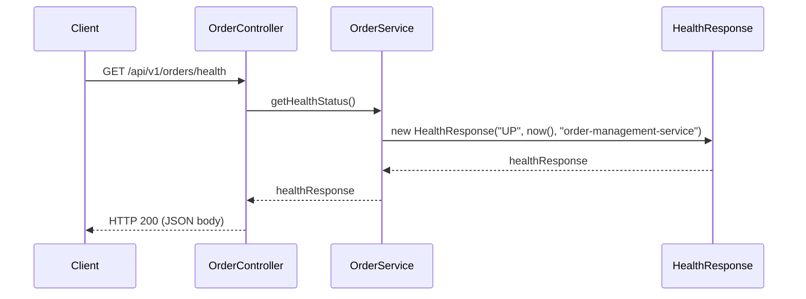
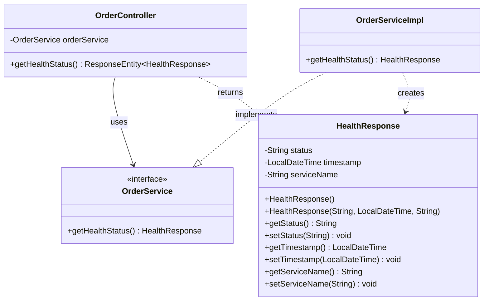
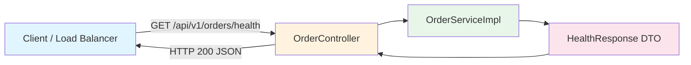

# Technical Design Document
**Story:** STORY-8
**Generated:** 2026-03-12T00:10:50.409762
**Status:** In Review

---


# Technical Design Document: STORY-003 — Add Health Check Endpoint for Order Service

---

## 1. Overview and Objectives

### Overview
This story adds a lightweight, custom health check endpoint to the existing Order Management Service. The endpoint returns a JSON payload indicating the service's operational status, name, and current timestamp. It is a simple read-only operation with **no database interaction**, following the existing controller → service → DTO layering pattern already established in the codebase.

### Objectives
| Objective | Detail |
|-----------|--------|
| **Observability** | Provide a simple, dedicated health probe at `/api/v1/orders/health` for load balancers, orchestrators (Kubernetes liveness/readiness), and monitoring dashboards. |
| **Consistency** | Follow the project's existing coding patterns (DTO, service interface/impl, annotated controller). |
| **Documentation** | Expose the endpoint through OpenAPI/Swagger with proper `@Operation` annotations. |
| **Quality** | Deliver with full unit and controller-layer tests. |

### Scope
- **In scope:** New DTO, service method, controller endpoint, Swagger docs, tests.
- **Out of scope:** Spring Boot Actuator `/actuator/health`, database connectivity checks, dependency health aggregation.

---

## 2. API Specification

### Endpoint

| Attribute | Value |
|-----------|-------|
| **Method** | `GET` |
| **Path** | `/api/v1/orders/health` |
| **Authentication** | None (public) |
| **Content-Type** | `application/json` |

### Response Schema

#### `HealthResponse` — HTTP 200

```json
{
  "status": "UP",
  "timestamp": "2025-07-15T14:30:00.123456",
  "serviceName": "order-management-service"
}
```

| Field | Type | Description | Example |
|-------|------|-------------|---------|
| `status` | `String` | Service operational status | `"UP"` |
| `timestamp` | `String` (ISO-8601 `LocalDateTime`) | Server time when the response was generated | `"2025-07-15T14:30:00.123456"` |
| `serviceName` | `String` | Canonical name of the service | `"order-management-service"` |

### OpenAPI Annotations

```
@Operation(summary = "Health Check", description = "Returns the current health status of the Order Management Service")
@ApiResponse(responseCode = "200", description = "Service is running normally")
```

### cURL Example

```bash
curl -s http://localhost:8080/api/v1/orders/health | jq .
```

---

## 3. Data Model Changes

**None.** This story introduces no entities, tables, migrations, or repository changes. The response is a stateless, in-memory DTO.

---

## 4. Architecture Diagram





### Component-Level View



---

## 5. Service Layer Design

### 5.1 DTO — `HealthResponse`

**Package:** `com.thd.ordermanagement.dto`

```java
package com.thd.ordermanagement.dto;

import java.time.LocalDateTime;

public class HealthResponse {

    private String status;
    private LocalDateTime timestamp;
    private String serviceName;

    public HealthResponse() {
    }

    public HealthResponse(String status, LocalDateTime timestamp, String serviceName) {
        this.status = status;
        this.timestamp = timestamp;
        this.serviceName = serviceName;
    }

    // --- Getters ---

    public String getStatus() {
        return status;
    }

    public LocalDateTime getTimestamp() {
        return timestamp;
    }

    public String getServiceName() {
        return serviceName;
    }

    // --- Setters ---

    public void setStatus(String status) {
        this.status = status;
    }

    public void setTimestamp(LocalDateTime timestamp) {
        this.timestamp = timestamp;
    }

    public void setServiceName(String serviceName) {
        this.serviceName = serviceName;
    }
}
```

**Design Notes:**
- Follows the same plain-POJO / JavaBean pattern as `OrderResponse` and `OrderCountSummaryResponse` (no Lombok, no records — consistent with existing codebase).
- `LocalDateTime` is serialized to ISO-8601 by Jackson's `JavaTimeModule` already on the classpath via `spring-boot-starter-web`.

---

### 5.2 Service Interface — `OrderService` (Addition)

**Package:** `com.thd.ordermanagement.service`

Add the following method signature to the existing interface:

```java
HealthResponse getHealthStatus();
```

Full interface after change:

```java
package com.thd.ordermanagement.service;

import com.thd.ordermanagement.dto.CreateOrderRequest;
import com.thd.ordermanagement.dto.HealthResponse;
import com.thd.ordermanagement.dto.OrderCountSummaryResponse;
import com.thd.ordermanagement.dto.OrderResponse;
import com.thd.ordermanagement.model.OrderStatus;

import java.time.LocalDateTime;
import java.util.List;

public interface OrderService {

    OrderResponse createOrder(CreateOrderRequest request);

    OrderResponse getOrderById(Long id);

    List<OrderResponse> getAllOrders();

    List<OrderResponse> getOrdersByStatus(OrderStatus status);

    List<OrderResponse> getOrdersByCustomerEmail(String email);

    List<OrderResponse> getOrdersByDateRange(LocalDateTime startDate, LocalDateTime endDate);

    OrderResponse updateOrderStatus(Long id, OrderStatus status);

    void cancelOrder(Long id);

    OrderCountSummaryResponse getOrderCountSummary();

    HealthResponse getHealthStatus();
}
```

---

### 5.3 Service Implementation — `OrderServiceImpl` (Addition)

**Package:** `com.thd.ordermanagement.service`

Add the following method to the existing `OrderServiceImpl` class:

```java
import com.thd.ordermanagement.dto.HealthResponse;

// ...existing code...

private static final String SERVICE_NAME = "order-management-service";
private static final String STATUS_UP = "UP";

@Override
@Transactional(readOnly = true)
public HealthResponse getHealthStatus() {
    return new HealthResponse(STATUS_UP, LocalDateTime.now(), SERVICE_NAME);
}
```

**Design Rationale:**
| Decision | Reason |
|----------|--------|
| Constants for `SERVICE_NAME` and `STATUS_UP` | Avoids magic strings, makes future extension easier. |
| `@Transactional(readOnly = true)` | Although no DB access occurs, the class-level `@Transactional` is already present; marking read-only is harmless and explicit. Alternatively, `@Transactional` could be omitted for this method — implementation team's discretion. |
| `LocalDateTime.now()` | Matches the `LocalDateTime` type required by AC-2. Uses the JVM's default time zone, consistent with `createdAt`/`updatedAt` fields in `Order`. |

---

### 5.4 Controller — `OrderController` (Addition)

**Package:** `com.thd.ordermanagement.controller`

Add the following method to the existing `OrderController` class:

```java
import com.thd.ordermanagement.dto.HealthResponse;

// ...existing code...

@GetMapping("/health")
@Operation(
    summary = "Health Check",
    description = "Returns the current health status of the Order Management Service"
)
@ApiResponse(responseCode = "200", description = "Service is running normally")
public ResponseEntity<HealthResponse> getHealthStatus() {
    HealthResponse response = orderService.getHealthStatus();
    return ResponseEntity.ok(response);
}
```

**Design Notes:**
- The method is placed in the existing `OrderController` which already has `@RequestMapping("/api/v1/orders")`, so the full path resolves to `GET /api/v1/orders/health`.
- Returns `ResponseEntity<HealthResponse>` for explicit HTTP status control, consistent with the existing controller methods.
- The `@Operation` and `@ApiResponse` annotations satisfy AC-4.

---

## 6. Testing Strategy

### 6.1 Unit Tests — `OrderServiceImpl.getHealthStatus()`

**File:** `src/test/java/com/thd/ordermanagement/service/OrderServiceImplHealthTest.java`

```java
package com.thd.ordermanagement.service;

import com.thd.ordermanagement.dto.HealthResponse;
import com.thd.ordermanagement.repository.OrderRepository;
import org.junit.jupiter.api.BeforeEach;
import org.junit.jupiter.api.DisplayName;
import org.junit.jupiter.api.Test;
import org.junit.jupiter.api.extension.ExtendWith;
import org.mockito.InjectMocks;
import org.mockito.Mock;
import org.mockito.junit.jupiter.MockitoExtension;

import java.time.LocalDateTime;

import static org.assertj.core.api.Assertions.assertThat;

@ExtendWith(MockitoExtension.class)
class OrderServiceImplHealthTest {

    @Mock
    private OrderRepository orderRepository; // required for @InjectMocks

    @InjectMocks
    private OrderServiceImpl orderService;

    @Test
    @DisplayName("getHealthStatus returns status UP")
    void getHealthStatus_shouldReturnStatusUp() {
        HealthResponse response = orderService.getHealthStatus();

        assertThat(response.getStatus()).isEqualTo("UP");
    }

    @Test
    @DisplayName("getHealthStatus returns correct service name")
    void getHealthStatus_shouldReturnCorrectServiceName() {
        HealthResponse response = orderService.getHealthStatus();

        assertThat(response.getServiceName()).isEqualTo("order-management-service");
    }

    @Test
    @DisplayName("getHealthStatus returns non-null timestamp close to now")
    void getHealthStatus_shouldReturnTimestampCloseToNow() {
        LocalDateTime before = LocalDateTime.now();
        HealthResponse response = orderService.getHealthStatus();
        LocalDateTime after = LocalDateTime.now();

        assertThat(response.getTimestamp()).isNotNull();
        assertThat(response.getTimestamp()).isAfterOrEqualTo(before);
        assertThat(response.getTimestamp()).isBeforeOrEqualTo(after);
    }

    @Test
    @DisplayName("getHealthStatus returns fully populated DTO")
    void getHealthStatus_shouldReturnFullyPopulatedDto() {
        HealthResponse response = orderService.getHealthStatus();

        assertThat(response).isNotNull();
        assertThat(response.getStatus()).isNotBlank();
        assertThat(response.getServiceName()).isNotBlank();
        assertThat(response.getTimestamp()).isNotNull();
    }
}
```

**Coverage targets (AC-5):**

| Test Case | Validates |
|-----------|-----------|
| Status is `"UP"` | AC-1, AC-3 |
| Service name is `"order-management-service"` | AC-2 |
| Timestamp is close to `now()` | AC-2 |
| All fields non-null/non-blank | DTO completeness |

---

### 6.2 Controller Tests — `OrderController.getHealthStatus()`

**File:** `src/test/java/com/thd/ordermanagement/controller/OrderControllerHealthTest.java`

```java
package com.thd.ordermanagement.controller;

import com.thd.ordermanagement.dto.HealthResponse;
import com.thd.ordermanagement.service.OrderService;
import org.junit.jupiter.api.DisplayName;
import org.junit.jupiter.api.Test;
import org.springframework.beans.factory.annotation.Autowired;
import org.springframework.boot.test.autoconfigure.web.servlet.WebMvcTest;
import org.springframework.boot.test.mock.bean.MockBean;
import org.springframework.http.MediaType;
import org.springframework.test.web.servlet.MockMvc;

import java.time.LocalDateTime;

import static org.mockito.Mockito.when;
import static org.springframework.test.web.servlet.request.MockMvcRequestBuilders.get;
import static org.springframework.test.web.servlet.result.MockMvcResultMatchers.*;

@WebMvcTest(OrderController.class)
class OrderControllerHealthTest {

    @Autowired
    private MockMvc mockMvc;

    @MockBean
    private OrderService orderService;

    private static final String HEALTH_ENDPOINT = "/api/v1/orders/health";

    @Test
    @DisplayName("GET /api/v1/orders/health returns HTTP 200")
    void healthEndpoint_shouldReturnOk() throws Exception {
        LocalDateTime fixedTime = LocalDateTime.of(2025, 7, 15, 10, 30, 0);
        HealthResponse mockResponse = new HealthResponse("UP", fixedTime, "order-management-service");

        when(orderService.getHealthStatus()).thenReturn(mockResponse);

        mockMvc.perform(get(HEALTH_ENDPOINT))
                .andExpect(status().isOk());
    }

    @Test
    @DisplayName("GET /api/v1/orders/health returns correct JSON structure")
    void healthEndpoint_shouldReturnCorrectJsonStructure() throws Exception {
        LocalDateTime fixedTime = LocalDateTime.of(2025, 7, 15, 10, 30, 0);
        HealthResponse mockResponse = new HealthResponse("UP", fixedTime, "order-management-service");

        when(orderService.getHealthStatus()).thenReturn(mockResponse);

        mockMvc.perform(get(HEALTH_ENDPOINT))
                .andExpect(status().isOk())
                .andExpect(content().contentType(MediaType.APPLICATION_JSON))
                .andExpect(jsonPath("$.status").value("UP"))
                .andExpect(jsonPath("$.timestamp").exists())
                .andExpect(jsonPath("$.serviceName").value("order-management-service"));
    }

    @Test
    @DisplayName("GET /api/v1/orders/health returns correct timestamp format")
    void healthEndpoint_shouldReturnTimestampInIsoFormat() throws Exception {
        LocalDateTime fixedTime = LocalDateTime.of(2025, 7, 15, 10, 30, 0);
        HealthResponse mockResponse = new HealthResponse("UP", fixedTime, "order-management-service");

        when(orderService.getHealthStatus()).thenReturn(mockResponse);

        mockMvc.perform(get(HEALTH_ENDPOINT))
                .andExpect(status().isOk())
                .andExpect(jsonPath("$.timestamp").value("2025-07-15T10:30:00"));
    }

    @Test
    @DisplayName("POST /api/v1/orders/health returns 405 Method Not Allowed")
    void healthEndpoint_postMethod_shouldReturn405() throws Exception {
        mockMvc.perform(
                org.springframework.test.web.servlet.request.MockMvcRequestBuilders
                    .post(HEALTH_ENDPOINT)
                    .contentType(MediaType.APPLICATION_JSON)
                    .content("{}"))
                .andExpect(status().isMethodNotAllowed());
    }
}
```

**Coverage targets (AC-6):**

| Test Case | Validates |
|-----------|-----------|
| Returns HTTP 200 | AC-3 |
| JSON has `status`, `timestamp`, `serviceName` | AC-1, AC-2 |
| Timestamp is ISO-8601 formatted | Serialization correctness |
| POST returns 405 | Endpoint only accepts GET |

---

### 6.3 DTO Unit Test (Optional / Bonus)

**File:** `src/test/java/com/thd/ordermanagement/dto/HealthResponseTest.java`

```java
package com.thd.ordermanagement.dto;

import org.junit.jupiter.api.DisplayName;
import org.junit.jupiter.api.Test;

import java.time.LocalDateTime;

import static org.assertj.core.api.Assertions.assertThat;

class HealthResponseTest {

    @Test
    @DisplayName("No-arg constructor creates instance with null fields")
    void noArgConstructor_shouldCreateInstanceWithNullFields() {
        HealthResponse response = new HealthResponse();

        assertThat(response.getStatus()).isNull();
        assertThat(response.getTimestamp()).isNull();
        assertThat(response.getServiceName()).isNull();
    }

    @Test
    @DisplayName("All-arg constructor populates all fields")
    void allArgConstructor_shouldPopulateAllFields() {
        LocalDateTime now = LocalDateTime.now();
        HealthResponse response = new HealthResponse("UP", now, "order-management-service");

        assertThat(response.getStatus()).isEqualTo("UP");
        assertThat(response.getTimestamp()).isEqualTo(now);
        assertThat(response.getServiceName()).isEqualTo("order-management-service");
    }

    @Test
    @DisplayName("Setters correctly update fields")
    void setters_shouldUpdateFields() {
        HealthResponse response = new HealthResponse();
        LocalDateTime now = LocalDateTime.now();

        response.setStatus("DOWN");
        response.setTimestamp(now);
        response.setServiceName("test-service");

        assertThat(response.getStatus()).isEqualTo("DOWN");
        assertThat(response.getTimestamp()).isEqualTo(now);
        assertThat(response.getServiceName()).isEqualTo("test-service");
    }
}
```

---

### 6.4 Test Summary Matrix

| Test Class | Type | Framework | Mocking | AC Coverage |
|-----------|------|-----------|---------|-------------|
| `OrderServiceImplHealthTest` | Unit | JUnit 5 + Mockito | `OrderRepository` mocked (unused) | AC-1, AC-2, AC-3, AC-5 |
| `OrderControllerHealthTest` | Controller (Slice) | `@WebMvcTest` + MockMvc | `OrderService` mocked | AC-1, AC-2, AC-3, AC-4, AC-6 |
| `HealthResponseTest` | Unit | JUnit 5 | None | AC-2 (DTO structure) |

---

## 7. Implementation Notes

### 7.1 Files to Create

| File | Package/Path |
|------|-------------|
| `HealthResponse.java` | `src/main/java/com/thd/ordermanagement/dto/` |
| `OrderServiceImplHealthTest.java` | `src/test/java/com/thd/ordermanagement/service/` |
| `OrderControllerHealthTest.java` | `src/test/java/com/thd/ordermanagement/controller/` |
| `HealthResponseTest.java` *(optional)* | `src/test/java/com/thd/ordermanagement/dto/` |

### 7.2 Files to Modify

| File | Change |
|------|--------|
| `OrderService.java` | Add `HealthResponse getHealthStatus();` method signature |
| `OrderServiceImpl.java` | Add implementation of `getHealthStatus()`, add constants, add import |
| `OrderController.java` | Add `getHealthStatus()` endpoint method, add import |

### 7.3 Dependencies

**No new dependencies required.** All annotations (`@Operation`, `@ApiResponse`) and testing utilities (`@WebMvcTest`, `MockMvc`, `Mockito`) are already available through existing POM dependencies:
- `springdoc-openapi-starter-webmvc-ui` (version `3.0.2`)
- `spring-boot-starter-test`

### 7.4 Configuration

No application property changes are required.

### 7.5 Constraints & Considerations

| Consideration | Detail |
|---------------|--------|
| **No Actuator conflict** | This custom endpoint at `/api/v1/orders/health` does not conflict with Spring Boot Actuator's `/actuator/health` (if Actuator is enabled later). |
| **Service name hardcoded** | The value `"order-management-service"` is hardcoded as a constant. If needed in the future, it can be externalized to `application.yml` via `@Value("${spring.application.name}")`. For a 1-SP story, the constant approach is sufficient. |
| **No security** | The endpoint is unauthenticated, consistent with the rest of the current API. |
| **Time zone** | `LocalDateTime.now()` uses the JVM's default zone. This is consistent with the existing `Order.createdAt` field behavior. |

### 7.6 Implementation Order (Suggested)

```
1. Create HealthResponse DTO
2. Add method to OrderService interface
3. Implement method in OrderServiceImpl
4. Add endpoint to OrderController
5. Write unit tests (OrderServiceImplHealthTest)
6. Write controller tests (OrderControllerHealthTest)
7. Write DTO tests (HealthResponseTest) — optional
8. Run full test suite: mvn clean test
9. Manual verification via Swagger UI at /swagger-ui.html
```

---

## 8. Error Handling Strategy

This endpoint is intentionally minimal and has a very narrow failure surface:

| Scenario | HTTP Status | Handling |
|----------|-------------|----------|
| Service is running normally | `200 OK` | Returns `HealthResponse` with `"UP"` |
| Unexpected exception in `getHealthStatus()` | `500 Internal Server Error` | Handled by the existing global `@ControllerAdvice` / Spring Boot default error handling |
| Wrong HTTP method (e.g., POST) | `405 Method Not Allowed` | Handled automatically by Spring MVC's request mapping |
| Path not found (typo) | `404 Not Found` | Handled automatically by Spring MVC |

**No custom exception classes are needed** for this story. The method is deterministic — it constructs an object from constants and `LocalDateTime.now()` — so the probability of runtime failure is effectively zero.

---

## Review Checklist
- [ ] API specifications are clear and complete
- [ ] Data model changes are well-defined
- [ ] Architecture diagrams are accurate
- [ ] Testing strategy is comprehensive
- [ ] Implementation is feasible within estimated points
