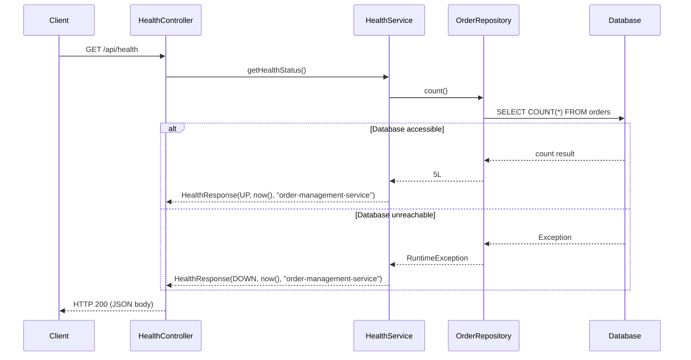
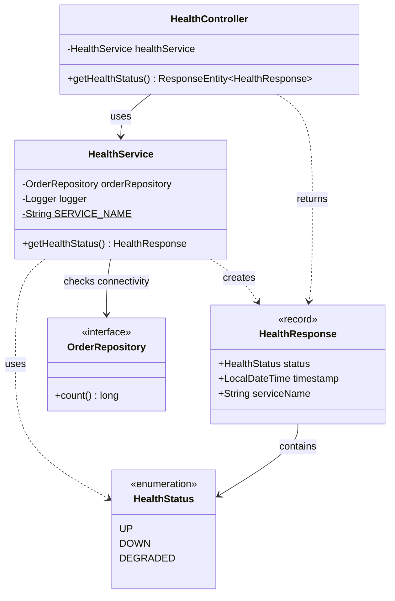
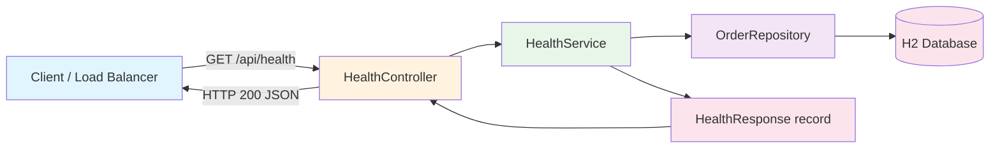

# Technical Design Document
**Story:** STORY-8
**Generated:** 2026-03-12T00:10:50.409762
**Updated:** 2026-03-12 (Post-implementation revision)
**Status:** Implemented

---

# Technical Design Document: STORY-8 — Add Health Check Endpoint for Order Service

---

## 1. Overview and Objectives

### Overview
This story adds a dedicated health check endpoint to the Order Management Service. The endpoint returns a JSON payload indicating the service's operational status (including database connectivity verification), service name, and current timestamp. Following the Single Responsibility Principle, the health check is implemented in its own `HealthService` and `HealthController`, separate from the order management logic.

### Objectives
| Objective | Detail |
|-----------|--------|
| **Observability** | Provide a dedicated health probe at `/api/health` for load balancers, orchestrators (Kubernetes liveness/readiness), and monitoring dashboards. |
| **Database Verification** | Verify actual database connectivity rather than returning a static "UP" response. |
| **Type Safety** | Use a `HealthStatus` enum (`UP`, `DOWN`, `DEGRADED`) instead of magic strings. |
| **Single Responsibility** | Separate health check concerns from order management via dedicated `HealthService` and `HealthController`. |
| **Modern Java** | Use a Java `record` for the response DTO, eliminating boilerplate. |
| **Documentation** | Expose the endpoint through OpenAPI/Swagger with proper `@Tag`, `@Operation`, and `@ApiResponse` annotations. |
| **Quality** | Deliver with full unit and controller-layer tests. |

### Scope
- **In scope:** `HealthStatus` enum, `HealthResponse` record, `HealthService`, `HealthController`, Swagger docs, unit and controller tests.
- **Out of scope:** Spring Boot Actuator `/actuator/health`, dependency health aggregation, external service checks.

---

## 2. API Specification

### Endpoint

| Attribute | Value |
|-----------|-------|
| **Method** | `GET` |
| **Path** | `/api/health` |
| **Authentication** | None (public) |
| **Content-Type** | `application/json` |

### Response Schema

#### `HealthResponse` — HTTP 200

**When database is accessible:**
```json
{
  "status": "UP",
  "timestamp": "2025-07-15T14:30:00.123456",
  "serviceName": "order-management-service"
}
```

**When database is unreachable:**
```json
{
  "status": "DOWN",
  "timestamp": "2025-07-15T14:30:00.123456",
  "serviceName": "order-management-service"
}
```

| Field | Type | Description | Possible Values |
|-------|------|-------------|-----------------|
| `status` | `HealthStatus` (enum) | Service operational status based on DB connectivity | `UP`, `DOWN`, `DEGRADED` |
| `timestamp` | `String` (ISO-8601 `LocalDateTime`) | Server time when the response was generated | ISO-8601 datetime |
| `serviceName` | `String` | Canonical name of the service | `"order-management-service"` |

### OpenAPI Annotations

```
@Tag(name = "Health", description = "Service health check endpoint")
@Operation(summary = "Health check", description = "Returns the health status of the service including database connectivity")
@ApiResponse(responseCode = "200", description = "Health status retrieved successfully")
```

### cURL Example

```bash
curl -s http://localhost:8080/api/health | jq .
```

---

## 3. Data Model Changes

**None.** This story introduces no entities, tables, or migrations. The `HealthStatus` enum and `HealthResponse` record are purely in-memory types. The `OrderRepository.count()` method (already available via `JpaRepository`) is used for the database connectivity check.

---

## 4. Architecture Diagram





### Component-Level View



---

## 5. Service Layer Design

### 5.1 Enum — `HealthStatus`

**Package:** `com.thd.ordermanagement.model`

```java
package com.thd.ordermanagement.model;

public enum HealthStatus {
    UP,
    DOWN,
    DEGRADED
}
```

**Design Notes:**
- Type-safe enum replaces magic strings like `"UP"` and `"DOWN"`.
- `DEGRADED` status is included for future use (e.g., partial dependency failures).

---

### 5.2 DTO — `HealthResponse`

**Package:** `com.thd.ordermanagement.dto`

```java
package com.thd.ordermanagement.dto;

import com.thd.ordermanagement.model.HealthStatus;

import java.time.LocalDateTime;

public record HealthResponse(HealthStatus status, LocalDateTime timestamp, String serviceName) {
}
```

**Design Notes:**
- Java `record` eliminates boilerplate (no manual getters, constructors, equals/hashCode).
- `HealthStatus` enum provides type safety — callers cannot pass arbitrary strings.
- `LocalDateTime` is serialized to ISO-8601 by Jackson's `JavaTimeModule` already on the classpath.

---

### 5.3 Service — `HealthService` (New, Dedicated)

**Package:** `com.thd.ordermanagement.service`

```java
package com.thd.ordermanagement.service;

import com.thd.ordermanagement.dto.HealthResponse;
import com.thd.ordermanagement.model.HealthStatus;
import com.thd.ordermanagement.repository.OrderRepository;
import org.slf4j.Logger;
import org.slf4j.LoggerFactory;
import org.springframework.stereotype.Service;

import java.time.LocalDateTime;

@Service
public class HealthService {

    private static final Logger logger = LoggerFactory.getLogger(HealthService.class);
    private static final String SERVICE_NAME = "order-management-service";

    private final OrderRepository orderRepository;

    public HealthService(OrderRepository orderRepository) {
        this.orderRepository = orderRepository;
    }

    public HealthResponse getHealthStatus() {
        try {
            orderRepository.count();
            return new HealthResponse(HealthStatus.UP, LocalDateTime.now(), SERVICE_NAME);
        } catch (Exception e) {
            logger.error("Health check failed: {}", e.getMessage(), e);
            return new HealthResponse(HealthStatus.DOWN, LocalDateTime.now(), SERVICE_NAME);
        }
    }
}
```

**Design Rationale:**
| Decision | Reason |
|----------|--------|
| Dedicated `HealthService` (not in `OrderServiceImpl`) | Single Responsibility Principle — health checking is a cross-cutting concern, not order business logic. |
| `orderRepository.count()` for DB check | Lightweight query that verifies actual database connectivity without side effects. |
| Catch-all `Exception` returning `DOWN` | Graceful degradation — never throws to the caller, always returns a valid response. |
| Error logging with stack trace | Aids debugging when health checks fail in production. |
| Constructor injection | Consistent with project patterns, enables easy testing with mocks. |

---

### 5.4 Controller — `HealthController` (New, Dedicated)

**Package:** `com.thd.ordermanagement.controller`

```java
package com.thd.ordermanagement.controller;

import com.thd.ordermanagement.dto.HealthResponse;
import com.thd.ordermanagement.service.HealthService;
import io.swagger.v3.oas.annotations.Operation;
import io.swagger.v3.oas.annotations.responses.ApiResponse;
import io.swagger.v3.oas.annotations.tags.Tag;
import org.springframework.http.ResponseEntity;
import org.springframework.web.bind.annotation.GetMapping;
import org.springframework.web.bind.annotation.RequestMapping;
import org.springframework.web.bind.annotation.RestController;

@RestController
@RequestMapping("/api/health")
@Tag(name = "Health", description = "Service health check endpoint")
public class HealthController {

    private final HealthService healthService;

    public HealthController(HealthService healthService) {
        this.healthService = healthService;
    }

    @GetMapping
    @Operation(summary = "Health check",
               description = "Returns the health status of the service including database connectivity")
    @ApiResponse(responseCode = "200", description = "Health status retrieved successfully")
    public ResponseEntity<HealthResponse> getHealthStatus() {
        HealthResponse response = healthService.getHealthStatus();
        return ResponseEntity.ok(response);
    }
}
```

**Design Notes:**
- Dedicated controller at `/api/health` — clean separation from order endpoints at `/api/v1/orders`.
- `@Tag` annotation groups health endpoints separately in Swagger UI.
- Returns `ResponseEntity<HealthResponse>` for explicit HTTP status control.

---

## 6. Testing Strategy

### 6.1 Unit Tests — `HealthService`

**File:** `src/test/java/com/thd/ordermanagement/service/HealthServiceTest.java`

```java
package com.thd.ordermanagement.service;

import com.thd.ordermanagement.dto.HealthResponse;
import com.thd.ordermanagement.model.HealthStatus;
import com.thd.ordermanagement.repository.OrderRepository;
import org.junit.jupiter.api.Test;
import org.junit.jupiter.api.extension.ExtendWith;
import org.mockito.InjectMocks;
import org.mockito.Mock;
import org.mockito.junit.jupiter.MockitoExtension;

import java.time.LocalDateTime;

import static org.junit.jupiter.api.Assertions.*;
import static org.mockito.Mockito.when;

@ExtendWith(MockitoExtension.class)
class HealthServiceTest {

    @Mock
    private OrderRepository orderRepository;

    @InjectMocks
    private HealthService healthService;

    @Test
    void should_returnUp_when_databaseIsAccessible() {
        when(orderRepository.count()).thenReturn(5L);

        LocalDateTime before = LocalDateTime.now();
        HealthResponse response = healthService.getHealthStatus();
        LocalDateTime after = LocalDateTime.now();

        assertEquals(HealthStatus.UP, response.status());
        assertEquals("order-management-service", response.serviceName());
        assertNotNull(response.timestamp());
        assertFalse(response.timestamp().isBefore(before));
        assertFalse(response.timestamp().isAfter(after));
    }

    @Test
    void should_returnDown_when_databaseIsUnreachable() {
        when(orderRepository.count()).thenThrow(new RuntimeException("Connection refused"));

        HealthResponse response = healthService.getHealthStatus();

        assertEquals(HealthStatus.DOWN, response.status());
        assertEquals("order-management-service", response.serviceName());
        assertNotNull(response.timestamp());
    }

    @Test
    void should_returnCorrectServiceName() {
        when(orderRepository.count()).thenReturn(0L);

        HealthResponse response = healthService.getHealthStatus();

        assertEquals("order-management-service", response.serviceName());
    }

    @Test
    void should_returnConsistentResults_when_calledMultipleTimes() {
        when(orderRepository.count()).thenReturn(10L);

        HealthResponse response1 = healthService.getHealthStatus();
        HealthResponse response2 = healthService.getHealthStatus();

        assertEquals(response1.status(), response2.status());
        assertEquals(response1.serviceName(), response2.serviceName());
        assertFalse(response2.timestamp().isBefore(response1.timestamp()));
    }
}
```

**Coverage targets:**

| Test Case | Validates |
|-----------|-----------|
| Returns `UP` when DB is accessible | DB connectivity check, happy path |
| Returns `DOWN` when DB throws exception | Graceful degradation |
| Correct service name | Constant correctness |
| Consistent results across calls | Deterministic behavior |
| Timestamp within expected range | `LocalDateTime.now()` accuracy |

---

### 6.2 Controller Tests — `HealthController`

**File:** `src/test/java/com/thd/ordermanagement/controller/HealthControllerTest.java`

```java
package com.thd.ordermanagement.controller;

import com.thd.ordermanagement.dto.HealthResponse;
import com.thd.ordermanagement.model.HealthStatus;
import com.thd.ordermanagement.service.HealthService;
import org.junit.jupiter.api.Test;
import org.springframework.beans.factory.annotation.Autowired;
import org.springframework.boot.webmvc.test.autoconfigure.WebMvcTest;
import org.springframework.test.context.bean.override.mockito.MockitoBean;
import org.springframework.test.web.servlet.MockMvc;

import java.time.LocalDateTime;

import static org.hamcrest.Matchers.is;
import static org.hamcrest.Matchers.notNullValue;
import static org.mockito.Mockito.*;
import static org.springframework.test.web.servlet.request.MockMvcRequestBuilders.*;
import static org.springframework.test.web.servlet.result.MockMvcResultMatchers.jsonPath;
import static org.springframework.test.web.servlet.result.MockMvcResultMatchers.status;

@WebMvcTest(HealthController.class)
class HealthControllerTest {

    @Autowired
    private MockMvc mockMvc;

    @MockitoBean
    private HealthService healthService;

    @Test
    void healthCheck_ShouldReturnCorrectStructure() throws Exception {
        HealthResponse response = new HealthResponse(
                HealthStatus.UP,
                LocalDateTime.of(2025, 1, 15, 10, 30, 0),
                "order-management-service"
        );
        when(healthService.getHealthStatus()).thenReturn(response);

        mockMvc.perform(get("/api/health"))
                .andExpect(status().isOk())
                .andExpect(jsonPath("$.status", is("UP")))
                .andExpect(jsonPath("$.timestamp", notNullValue()))
                .andExpect(jsonPath("$.serviceName", is("order-management-service")));

        verify(healthService, times(1)).getHealthStatus();
    }

    @Test
    void healthCheck_ShouldReturnDown_WhenServiceIsUnhealthy() throws Exception {
        HealthResponse response = new HealthResponse(
                HealthStatus.DOWN, LocalDateTime.now(), "order-management-service"
        );
        when(healthService.getHealthStatus()).thenReturn(response);

        mockMvc.perform(get("/api/health"))
                .andExpect(status().isOk())
                .andExpect(jsonPath("$.status", is("DOWN")))
                .andExpect(jsonPath("$.serviceName", is("order-management-service")));
    }

    @Test
    void healthCheck_PostMethodNotAllowed() throws Exception {
        mockMvc.perform(post("/api/health"))
                .andExpect(status().isMethodNotAllowed());
        verify(healthService, never()).getHealthStatus();
    }

    @Test
    void healthCheck_PutMethodNotAllowed() throws Exception {
        mockMvc.perform(put("/api/health"))
                .andExpect(status().isMethodNotAllowed());
    }

    @Test
    void healthCheck_DeleteMethodNotAllowed() throws Exception {
        mockMvc.perform(delete("/api/health"))
                .andExpect(status().isMethodNotAllowed());
    }

    @Test
    void healthCheck_ServiceThrowsException_Returns500() throws Exception {
        when(healthService.getHealthStatus()).thenThrow(new RuntimeException("Unexpected error"));

        mockMvc.perform(get("/api/health"))
                .andExpect(status().isInternalServerError());
    }
}
```

**Coverage targets:**

| Test Case | Validates |
|-----------|-----------|
| Returns HTTP 200 with correct JSON structure | Happy path, field names |
| Returns `DOWN` status when unhealthy | Degraded state rendering |
| POST/PUT/DELETE return 405 | Only GET is allowed |
| Service exception returns 500 | Unexpected error handling |

---

### 6.3 Test Summary Matrix

| Test Class | Type | Framework | Mocking | Coverage |
|-----------|------|-----------|---------|----------|
| `HealthServiceTest` | Unit | JUnit 5 + Mockito | `OrderRepository` mocked | DB check UP/DOWN, service name, timestamp, consistency |
| `HealthControllerTest` | Controller (Slice) | `@WebMvcTest` + MockMvc | `HealthService` mocked | HTTP status, JSON structure, method restrictions, error handling |

---

## 7. Implementation Notes

### 7.1 Files Created

| File | Package/Path |
|------|-------------|
| `HealthStatus.java` | `src/main/java/com/thd/ordermanagement/model/` |
| `HealthResponse.java` | `src/main/java/com/thd/ordermanagement/dto/` |
| `HealthService.java` | `src/main/java/com/thd/ordermanagement/service/` |
| `HealthController.java` | `src/main/java/com/thd/ordermanagement/controller/` |
| `HealthServiceTest.java` | `src/test/java/com/thd/ordermanagement/service/` |
| `HealthControllerTest.java` | `src/test/java/com/thd/ordermanagement/controller/` |

### 7.2 Files Modified

| File | Change |
|------|--------|
| `OrderService.java` | No change — health check is in dedicated `HealthService` |
| `OrderServiceImpl.java` | No change — health check is in dedicated `HealthService` |
| `OrderController.java` | No change — health check is in dedicated `HealthController` |

### 7.3 Dependencies

**No new dependencies required.** All annotations (`@Operation`, `@ApiResponse`, `@Tag`) and testing utilities (`@WebMvcTest`, `MockMvc`, `Mockito`) are already available through existing POM dependencies:
- `springdoc-openapi-starter-webmvc-ui`
- `spring-boot-starter-test`

### 7.4 Configuration

No application property changes are required.

### 7.5 Key Design Decisions

| Decision | Rationale |
|----------|-----------|
| **Dedicated `HealthService` + `HealthController`** | Single Responsibility Principle — health checking is orthogonal to order management. Keeps `OrderServiceImpl` focused on business logic. |
| **`HealthStatus` enum** | Type safety — prevents typos and enables compile-time checking. `DEGRADED` status future-proofs for partial failure scenarios. |
| **Java `record` for DTO** | Modern Java idiom — eliminates ~35 lines of boilerplate (constructors, getters, setters, equals, hashCode). Immutable by default. |
| **`/api/health` path** | Clean, standard path for health probes. Not nested under `/api/v1/orders` because health checking is not an order operation. |
| **`orderRepository.count()` for DB check** | Lightweight SELECT COUNT that verifies real database connectivity without side effects. |
| **Always returns 200** | Even when `DOWN`, returns HTTP 200 with status in the body. Load balancers can inspect the JSON `status` field. This avoids conflating transport-level errors with application health state. |
| **Graceful degradation on exception** | `HealthService` never throws — catches all exceptions and returns `DOWN` status with error logging. |

### 7.6 Constraints & Considerations

| Consideration | Detail |
|---------------|--------|
| **No Actuator conflict** | Custom endpoint at `/api/health` does not conflict with Spring Boot Actuator's `/actuator/health` (if Actuator is enabled later). |
| **Service name hardcoded** | The value `"order-management-service"` is hardcoded as a constant. Can be externalized to `application.yml` via `@Value("${spring.application.name}")` if needed. |
| **No security** | The endpoint is unauthenticated, consistent with the rest of the current API. |
| **Time zone** | `LocalDateTime.now()` uses the JVM's default zone, consistent with `Order.createdAt` field behavior. |

---

## 8. Error Handling Strategy

| Scenario | HTTP Status | Handling |
|----------|-------------|----------|
| Database accessible | `200 OK` | Returns `HealthResponse` with `status: "UP"` |
| Database unreachable | `200 OK` | Returns `HealthResponse` with `status: "DOWN"` (graceful degradation) |
| Unexpected exception in `HealthService` | `500 Internal Server Error` | Handled by the existing `GlobalExceptionHandler` |
| Wrong HTTP method (POST, PUT, DELETE) | `405 Method Not Allowed` | Handled by `GlobalExceptionHandler.handleHttpRequestMethodNotSupportedException()` |
| Path not found (typo) | `404 Not Found` | Handled by `GlobalExceptionHandler.handleNoResourceFoundException()` |

---

## Review Checklist
- [x] API specifications are clear and complete
- [x] Data model changes are well-defined (none required)
- [x] Architecture diagrams are accurate
- [x] Testing strategy is comprehensive
- [x] Implementation follows Single Responsibility Principle
- [x] Type-safe enum used instead of magic strings
- [x] Modern Java record used for DTO
- [x] Database connectivity actually verified
- [x] Implementation is complete and merged
